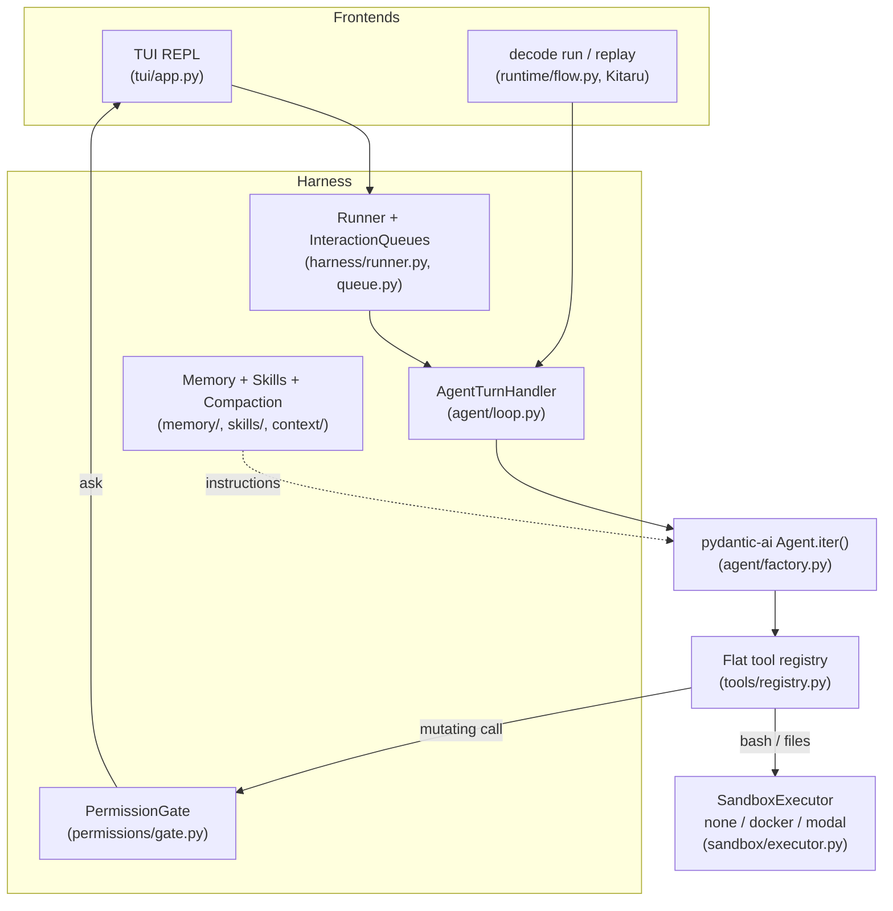
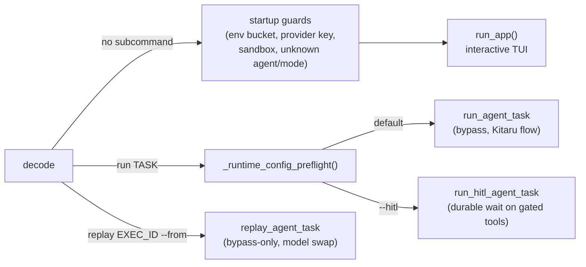
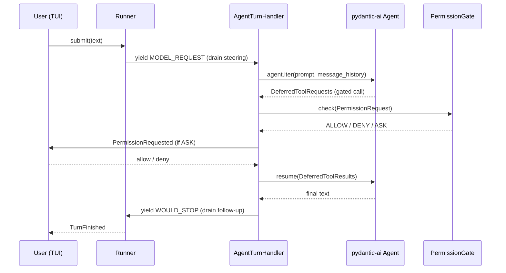
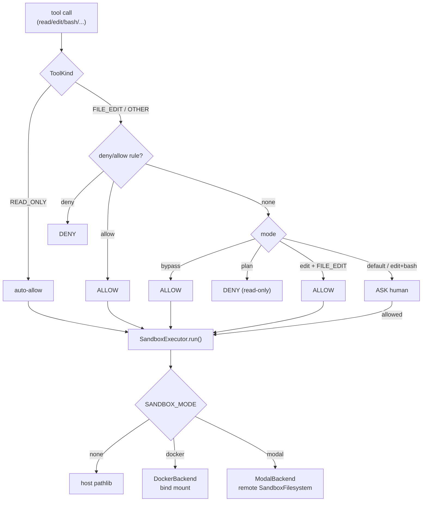
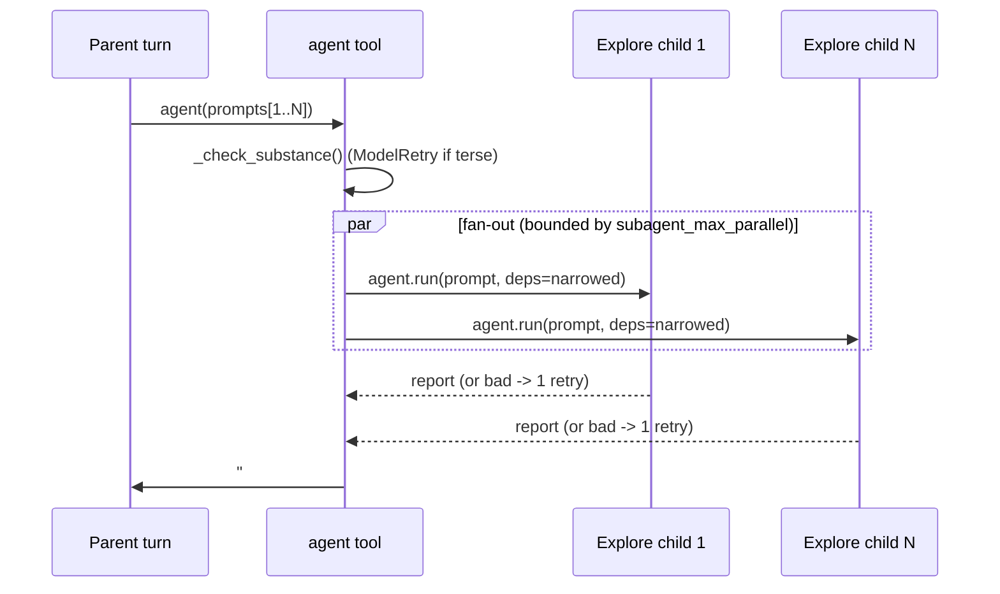

# building-a-coding-agent-from-scratch-course — Architecture

> Clone: `raw/repos/.github-decodingai-magazine-building-a-coding-agent-from-scratch-course/` · [decodingai-magazine/building-a-coding-agent-from-scratch-course](https://github.com/decodingai-magazine/building-a-coding-agent-from-scratch-course) @ `6ee643f`

> Scope: covers `src/decode/` — the CLI/TUI, the agent loop, the harness (runner, permissions, sandbox, memory, skills), and the headless Kitaru runtime — plus the README and `AGENTS.md`. Skips `evals/` (benchmark + regression harness), `tests/`, `docker/`, `scripts/`, and the GCP/Modal deploy plumbing under `runtime/modal_app.py`; those are real subsystems but not needed to read the harness itself.

## 1. Bird's-eye view

Decode is a single Pydantic AI `Agent` — the model-calling loop is genuinely ~20 lines — wrapped in a much larger harness that everyone actually builds across the course: tools, permissions, sandboxing, memory, compaction, a durable headless runtime, and subagent fan-out.

```python
agent = Agent(
    build_model(settings.llm_provider),        # gemini | openrouter | modal
    deps_type=AgentDeps,                       # cwd, event sink, permission gate
    output_type=[str, DeferredToolRequests],   # final answer, or tools paused for approval
)
register_tools(agent)                          # read, edit, bash, grep, ...

async with agent.iter(prompt, message_history=history) as run:
    async for node in run:                     # model request → tool calls → repeat
        stream_events(node)
```
[README.md#L45-L54](https://github.com/decodingai-magazine/building-a-coding-agent-from-scratch-course/blob/6ee643fbfeb10d3f9b463bf2a6cdfb64671b8aea/README.md#L45-L54)

Two front ends drive the same `build_agent()`: an interactive TUI (`prompt_toolkit` input, Rich output) and a headless Kitaru-backed runtime for `decode run` / `decode replay`. Both sit on top of one harness stack.



## 2. Layout

- `src/decode/cli.py` — Click entrypoint: bare `decode` launches the REPL, `decode run`/`decode replay` drive the headless runtime.
- `src/decode/tui/` — the REPL: `prompt_toolkit` input + Rich output, one input surface for chat, steering and permission answers.
- `src/decode/harness/` — `Runner`, the steering/follow-up `InteractionQueues`, and the turn boundary machine.
- `src/decode/agent/` — the Pydantic AI agent: `factory.py` builds it, `loop.py` (`AgentTurnHandler`) drives `agent.iter()` as the harness turn handler, `deps.py` is the injected `AgentDeps`.
- `src/decode/agents/` — the built-in Agents Catalog (Build / Plan / Code-Reviewer primaries, Explore subagent) loaded from bundled Markdown personas.
- `src/decode/tools/` — the flat tool registry: files, bash, web, LSP, tasks, `ask_user`, the `agent` fan-out tool, plan-mode controls.
- `src/decode/permissions/` — the `PermissionGate` policy (allow/ask/deny by mode × tool kind + rule sets).
- `src/decode/sandbox/` — `SandboxExecutor` over a `none`/`docker`/`modal` backend seam.
- `src/decode/context/` — compaction (full + micro tiers) and the JSONL session log.
- `src/decode/memory/` — `AGENTS.md`/`MEMORY.md` discovery and assembly into the system prompt.
- `src/decode/skills/` — the skills catalog + dispatcher (a `SKILL.md`-per-folder convention).
- `src/decode/runtime/` — the headless Kitaru durable flow (`decode run`/`decode replay`) and the Modal deploy app.
- `src/decode/services/lsp/` — a hand-rolled stdio LSP client backing the `lsp` tool.
- `src/decode/observability/` — Opik tracing + cost accounting.
- `evals/`, `tests/`, `docs/adr/`, `tasks/` — benchmark/regression eval harness, unit/integration tests, 19 Architecture Decision Records, and a file-based task tracker (not read for this page).

## 3. Entry flow

`decode` is one Click group with three surfaces sharing the same `build_agent()`: the bare command launches the REPL; `decode run` executes one task headlessly through a Kitaru Durable Flow (bypass, or `--hitl` for human-in-the-loop gating); `decode replay` re-executes a recorded run from a checkpoint with a swapped model.



Every headless guard chain is centralized so the REPL and `decode run`/`replay` can never drift: environment-bucket → provider config → `RUNTIME_ENABLED` → sandbox backend → sandbox-repo.

```python
    # Launch the REPL: bare ``--resume`` arrives as "latest", a named one as its id, no flag as None.
    # In ``none`` mode ``resolved_repo`` is guaranteed None (guard above), so the REPL is unchanged.
    asyncio.run(run_app(resume=resume, agent=agent, mode=mode, repo=resolved_repo, local=local))
```
[src/decode/cli.py#L407-L409](https://github.com/decodingai-magazine/building-a-coding-agent-from-scratch-course/blob/6ee643fbfeb10d3f9b463bf2a6cdfb64671b8aea/src/decode/cli.py#L407-L409)

`kitaru` is imported lazily inside the `run`/`replay` commands, so `DECODE_ENV=local` REPL sessions never load it — the durable runtime is opt-in weight, not a baseline dependency of the interactive path.

## 4. Core loop

The `Runner` (`harness/runner.py`) is a single-flight phase machine (`idle → dispatching → running → idle`) that drives one `TurnHandler` async generator per turn. `AgentTurnHandler.__call__` (`agent/loop.py`) runs that turn as one or more **legs**: each model request is preceded by a `MODEL_REQUEST` boundary where the runner drains queued *steering* text into the prompt, and each stop is preceded by a `WOULD_STOP` boundary where queued *follow-up* text either ends the turn or starts another leg. A gated tool call pauses the leg as a `DeferredToolRequests`, is resolved through the `PermissionGate`, and resumes.



Instructions are assembled fresh every turn as **one** system-prompt block (strict OpenAI-compatible servers reject more than one `system` message): base prompt + active persona + `assemble_memory()` (`AGENTS.md`/`MEMORY.md`, root-most → cwd-most, `MEMORY.md` capped since it's model-written) + `assemble_skills_catalog()`.

```python
built_model = _build_model(flow_mode=flow_mode, model=model)
agent: Agent[AgentDeps, str | DeferredToolRequests] = Agent(
    built_model,
    deps_type=AgentDeps,
    output_type=[str, DeferredToolRequests],
    output_retries=3,
    tool_retries=5,
)
register_tools(agent)
_register_instructions(agent)
set_main_agent(agent)  # subagent-spawn seam: children re-enter this same Agent
```
[src/decode/agent/factory.py#L55-L66](https://github.com/decodingai-magazine/building-a-coding-agent-from-scratch-course/blob/6ee643fbfeb10d3f9b463bf2a6cdfb64671b8aea/src/decode/agent/factory.py#L55-L66)

A two-tier compaction cascade runs at every `WOULD_STOP`: a no-LLM **microcompaction** blanks stale tool-output bodies once occupancy crosses a lower reserve, and a full **LLM compaction** replaces history with `[summary, *tail]` once it crosses a higher reserve — sized off the *last* response's own token usage, not the cumulative per-round total pydantic-ai reports.

## 5. Permissions and sandbox

Every registered tool carries a `ToolKind` (`READ_ONLY` / `FILE_EDIT` / `OTHER`). The `PermissionGate` evaluates, per call: deny rules (user + active-agent rule sets, union) → allow rules → the pure mode × kind table.

```python
def _decide_by_mode(self, kind: ToolKind) -> PermissionDecision:
    """The pure mode x kind decision (below the rule layer)."""
    mode = self._mode
    if mode is PermissionMode.BYPASS:
        return PermissionDecision.allow(mode=mode)
    if kind is ToolKind.READ_ONLY:
        return PermissionDecision.allow(mode=mode)
    # A mutating tool (FILE_EDIT or OTHER) below this point.
    if mode is PermissionMode.PLAN:
        return PermissionDecision.deny(mode=mode, reason=_PLAN_DENY_REASON)
    if mode is PermissionMode.EDIT and kind is ToolKind.FILE_EDIT:
        return PermissionDecision.allow(mode=mode)
    # DEFAULT (any mutation) and EDIT (non-file-edit, i.e. bash) ask the human.
    return PermissionDecision.ask(mode=mode)
```
[src/decode/permissions/gate.py#L95-L108](https://github.com/decodingai-magazine/building-a-coding-agent-from-scratch-course/blob/6ee643fbfeb10d3f9b463bf2a6cdfb64671b8aea/src/decode/permissions/gate.py#L95-L108)

`bash` and the file tools run through one `SandboxExecutor` over a `SandboxBackend` Protocol selected by `SANDBOX_MODE`: `none` (direct host pathlib, the default), `docker` (pathlib on a live bind mount), or `modal` (a remote `SandboxFilesystem`). Every backend is **fresh-exec** — each command is a new process, so `cd`/`export` never persist, only the filesystem does — and the sandbox is created lazily on first use.



## 6. Subagent fan-out

The one model-callable `agent` tool spawns up to 6 read-only **Explore** subagents concurrently, each a fresh nested `agent.run()` re-entering the *same* installed Pydantic AI Agent with narrowed deps (`active_agent=explore`, gate forced to `BYPASS`, silent event sink) so its visible toolset collapses to `read`/`glob`/`grep`/`lsp` and recursion is structurally impossible. Quality is enforced on both ends: an under-specified prompt (<8 words) is rejected before any child spawns via `ModelRetry`; a child whose report is empty or backed by zero tool calls gets exactly one re-spawn with a nudge, then gives up with a note — two attempts, never three.



Each child's report is truncated to a *shared* budget (`subagent_result_max_bytes // len(prompts)`), so a wide fan-out costs the parent's context no more than a narrow one; the harness-owned `SYNTHESIS_FOOTER` is appended after truncation, instructing the parent model to compile — not just relay — the N reports.

```python
sections = await asyncio.gather(
    *(
        _spawn_child(ctx, prompt, index=index, max_bytes=child_max_bytes)
        for index, prompt in enumerate(prompts, start=1)
    )
)
```
[src/decode/tools/agent.py#L374-L379](https://github.com/decodingai-magazine/building-a-coding-agent-from-scratch-course/blob/6ee643fbfeb10d3f9b463bf2a6cdfb64671b8aea/src/decode/tools/agent.py#L374-L379)

## Reading order

1. `README.md` — the ~20-line agent, the harness/frontend split, the tech stack.
2. `AGENTS.md` — the project structure map and the invariants (sandbox seam, harness-home vs. cwd, credential handling) that aren't visible from the code alone.
3. `src/decode/agent/factory.py` — how the Agent is actually built.
4. `src/decode/agent/loop.py` — the turn-boundary state machine that drives it.
5. `src/decode/harness/runner.py` + `harness/queue.py` — the single-flight phase machine and steering/follow-up queues.
6. `src/decode/tools/registry.py` + `permissions/gate.py` — what's callable and who approves it.
7. `docs/adr/` — 19 numbered ADRs; each non-obvious decision in this page cites one.

## Connections

- **Entities**: [[wiki/entities/decode]], [[wiki/entities/pydantic-ai]], [[wiki/entities/modal]], [[wiki/entities/kitaru]]
- **Concepts**: [[wiki/concepts/agent-harness]], [[wiki/concepts/cli]], [[wiki/concepts/skills]], [[wiki/concepts/agent-memory]], [[wiki/concepts/orchestration]]

> Synthesis: where the notes and articles in this wiki *argue* the harness — not the model — is what makes a coding agent good, this codebase is that argument made concrete: permissions, sandboxing, compaction and subagent fan-out are the majority of the code, and the model-calling loop genuinely is the ~20 lines the README claims.
