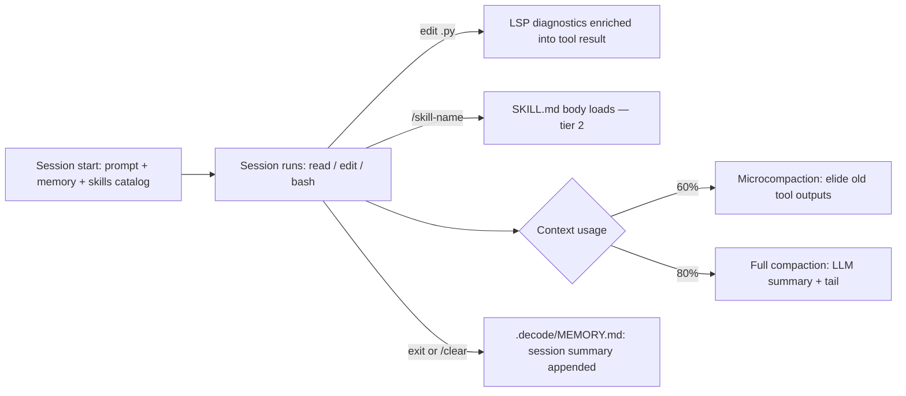

# Context Engineering for Coding Agents

> [[raw/article-context-engineering-for-coding-agents|Raw]] · article · [decodingai.com](https://www.decodingai.com/p/context-engineering-for-coding-agents)

## Summary

Lesson 4 of the open-source course *Building a Coding Agent From Scratch*,
which builds **Decode**, a Python coding agent, lesson by lesson. Opening
claim: harness engineering, not the model, decides quality — via LangChain's
Terminal-Bench result, where swapping only the harness moved a coding agent
from ~30th place into the top 5. This lesson covers context engineering: what
enters the window, what stays out, how it gets trimmed before it rots — across
four harness components.

Walking through a real Decode session (the `demo-5-sandbox-feature-pr` skill),
it covers each component with code from the course repo: `AGENTS.md`
(hand-written) plus `.decode/MEMORY.md` (auto-extracted) for memory; a 3-tier
progressive-disclosure loading scheme for skills; a `ty`-based LSP server
feeding on-demand queries plus passive diagnostics on every edit; and three
compaction tiers (`/clear`, full, micro) keyed to token thresholds. It closes
by naming what it deliberately skipped — an MCP client, an auto-mode
permission layer — and previews lesson 5 on subagents.

## Key claims

- Harness engineering, not the model, is the primary lever: in LangChain's
  Terminal-Bench experiment, swapping only the harness (same model) moved a
  coding agent from ~30th place into the top 5.
  [[raw/article-context-engineering-for-coding-agents#Lesson 4: Context Engineering for Coding Agents|cite]]
- Decode assembles its system prompt at session start from four parts — base
  prompt, active agent prompt, memory files (`AGENTS.md` + `.decode/MEMORY.md`),
  and a one-line-per-skill catalog — before Pydantic AI adds each tool's schema.
  [[raw/article-context-engineering-for-coding-agents#The context lifecycle of a session|cite]]
- `AGENTS.md` is hand-written project context (under 300 lines, ~600-line
  guardrail); `.decode/MEMORY.md` is auto-extracted — one LLM call per
  session-end distills the conversation into a dated bullet, capped at 200
  lines / 25,000 bytes (oldest dropped first), periodically rewritten in
  place by Memory Compression.
  [[raw/article-context-engineering-for-coding-agents#Memory: Stop repeating your instructions|cite]]
- Skills load through 3 progressive-disclosure tiers — a name+description
  catalog line, a full `SKILL.md` body on invocation, then bundled files on
  demand — motivated by upfront MCP tool schemas alone measured to consume
  7–9% of the context window before any work begins.
  [[raw/article-context-engineering-for-coding-agents#Skills: Never load what you can reference|cite]]
- The `ty` LSP server feeds two channels: an on-demand `lsp` tool
  (`definition`/`references`/`hover`/`diagnostics`) and a passive Diagnostics
  Enricher appending type errors to every successful Python write/edit, so the
  agent fixes an unimported reference before running tests.
  [[raw/article-context-engineering-for-coding-agents#The LSP server: Replace guessing with precision|cite]]
- Compaction runs in three tiers against token-usage thresholds: `/clear`
  wipes the window after a memory write-back; full compaction (auto at 80%,
  or `/compact`) rewrites it as system prompt + a 6-part LLM summary + a
  ~20K-token tail snapped to a Compaction Boundary; microcompaction (60%, no
  LLM call) replaces old tool outputs with a placeholder in place.
  [[raw/article-context-engineering-for-coding-agents#Compaction: Delete before the window rots|cite]]

## Notable quotes

> "An LSP server is one of the most underrated components, particularly for coding harnesses."
> — [[raw/article-context-engineering-for-coding-agents#The LSP server: Replace guessing with precision|location]]

> "The fix was to write the preference down once into the `AGENTS.md`, where the agent reads it every turn."
> — [[raw/article-context-engineering-for-coding-agents#Memory: Stop repeating your instructions|location]]

> "When your coding agent's window fills up mid-task, what do you actually do today: `/clear` and lose the thread, `/compact` and hope the summary gets the job done, or just keep going until it degrades?"
> — [[raw/article-context-engineering-for-coding-agents#Next steps|location]]

## Connections

- **Entities**: [[wiki/entities/claude-code]], [[wiki/entities/decode]], [[wiki/entities/ty]]
- **Concepts**: [[wiki/concepts/agent-memory]], [[wiki/concepts/skills]], [[wiki/concepts/compaction]], [[wiki/concepts/context-engineering]], [[wiki/concepts/lsp]]

> Synthesis: The wiki's most mechanism-level account of memory and skills —
> concrete code (`extract_on_exit`, `format_skill_payload`, `should_compact`)
> rather than the CLI-vs-MCP framing in [[wiki/sources/why-mcp-is-not-dead]] —
> and it explicitly defers MCP itself as a component it hasn't covered yet.
