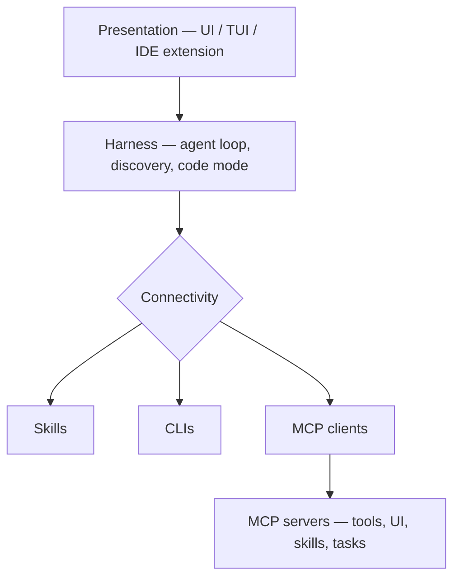

# System Architecture of Future AI Apps

> [[raw/system-architecture-of-future-ai-apps-ui-tui-ide-extension|Raw]] · local

## Summary

Structured notes on a talk by David Soria Parra (MCP co-creator, Anthropic, AI Engineer 2026), arguing that serious AI applications are converging on four stacked, independently-evolving layers rather than one monolithic backend. The note's own diagram is the clearest statement of the shape:

The note's core move is that none of these four layers is a fixed monolith anymore: presentation is becoming a thin renderer of server-shipped contracts, the harness is where two specific engineering patterns (progressive tool discovery and code-mode/programmatic tool calling) now live, connectivity is explicitly plural (skills, CLIs, and MCP clients each best at a different job, used together), and MCP servers are expected to ship task-shaped tools, UI, and domain knowledge rather than being thin REST wrappers. A closing checklist and a set of open questions (arbitration between skills/CLIs/MCP, governance of skills-over-MCP, UX ownership across MCP apps) frame this as a build guide, not just an argument.

## Key claims

- DSP frames the industry's trajectory as "2024 was demos, 2025 was coding agents, 2026 is connectivity" — general knowledge-worker agents need all four layers because they must reach many SaaS apps, unlike sandboxed coding agents. [[raw/system-architecture-of-future-ai-apps-ui-tui-ide-extension#1. The Big Picture|cite]]
- Progressive tool discovery (a `tool_search`-style capability, loaded up front instead of every tool schema) is a harness-side responsibility the protocol already supports; Claude Code shipped it and saw a large reduction in tool-context usage. [[raw/system-architecture-of-future-ai-apps-ui-tui-ide-extension#3.1 Progressive Discovery|cite]]
- Programmatic tool calling ("code mode") replaces model-orchestrated call→inspect→call round-trips with a script, written by the model inside a sandbox (V8 isolate, Lua, sandboxed Python), that composes MCP's structured tool output directly. [[raw/system-architecture-of-future-ai-apps-ui-tui-ide-extension#3.2 Programmatic Tool Calling (Code Mode)|cite]]
- Good MCP servers should be designed task-shaped (`schedule_meeting_with_summary`) rather than endpoint-shaped (`POST /calendars/{id}/events`), since endpoint-shaped tools force the model back into low-level orchestration. [[raw/system-architecture-of-future-ai-apps-ui-tui-ide-extension#5.1 Stop Wrapping REST APIs One-to-One|cite]]
- Skills, CLIs, and MCP clients are three distinct connectivity primitives, not competing options: skills carry stable domain knowledge, CLIs win for pre-trained/local/composable surfaces, MCP covers auth, remote access, and rich semantics. [[raw/system-architecture-of-future-ai-apps-ui-tui-ide-extension#4. Layer 3 — Connectivity (Skills, CLIs, MCP Clients)|cite]]
- Cloudflare's MCP server exposes one JavaScript-execution tool instead of ~80 discrete tools, cited as the canonical example of server-side code mode. [[raw/system-architecture-of-future-ai-apps-ui-tui-ide-extension#5.2 Server-Side Execution Environments|cite]]

## Notable quotes

> "2024 was demos. 2025 was coding agents. 2026 is connectivity."
> — [[raw/system-architecture-of-future-ai-apps-ui-tui-ide-extension#1. The Big Picture|location]]

> "if you're a CLI you just have a hard time rendering HTML."
> — [[raw/system-architecture-of-future-ai-apps-ui-tui-ide-extension#2. Layer 1 — Presentation (UI / TUI / IDE Extension)|location]]

> "Every time I see someone building another REST to MCP server conversion tool, I'm — it's a bit cringe."
> — [[raw/system-architecture-of-future-ai-apps-ui-tui-ide-extension#5.1 Stop Wrapping REST APIs One-to-One|location]]

## Connections

- **Entities**: [[wiki/entities/claude-code]], [[wiki/entities/cloudflare]], [[wiki/entities/david-soria-parra]]
- **Concepts**: [[wiki/concepts/mcp]], [[wiki/concepts/code-mode]], [[wiki/concepts/progressive-tool-discovery]], [[wiki/concepts/skills]], [[wiki/concepts/mcp-applications]], [[wiki/concepts/cli]], [[wiki/concepts/agent-harness]]

> Synthesis: This is a structured, annotated breakdown of David Soria Parra's "Future of MCP" talk (the note names it as its source anchor) rather than primary reporting — treat its claims as one witness to that talk, not an independent corroboration if another source in this wiki transcribes the same material.
