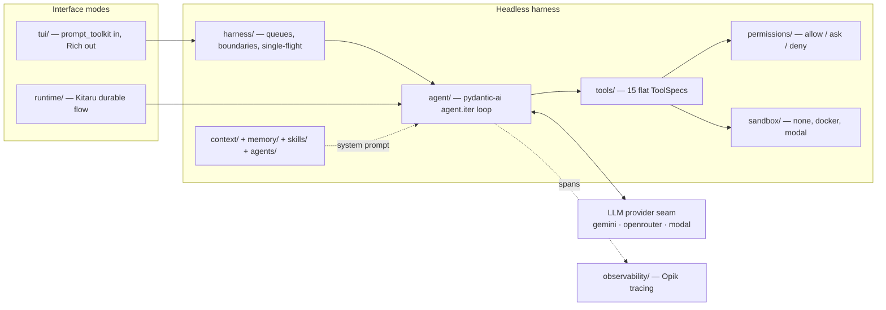
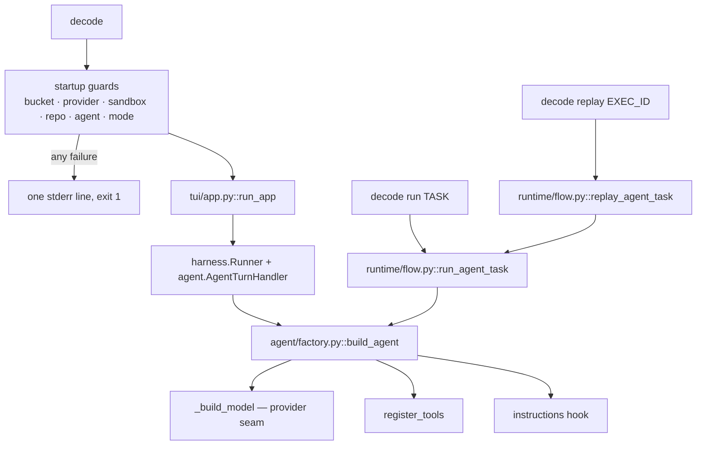
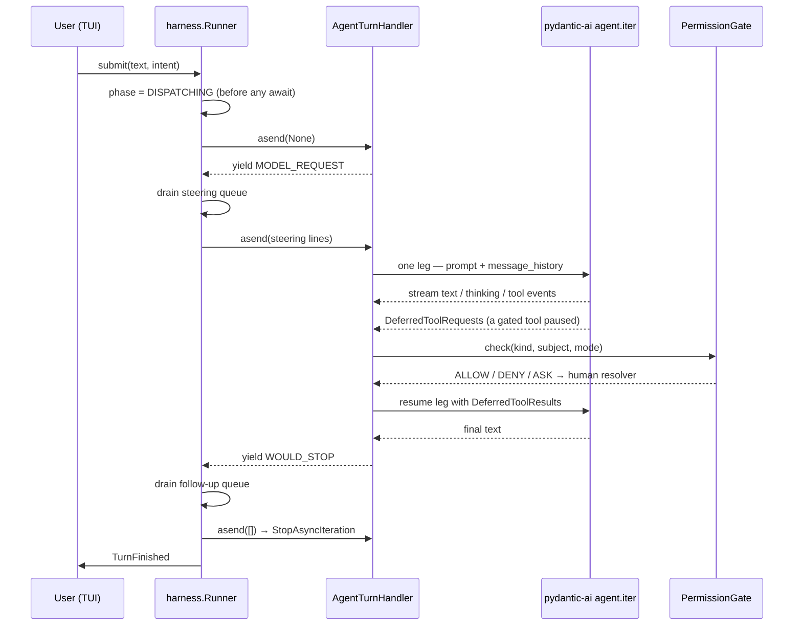
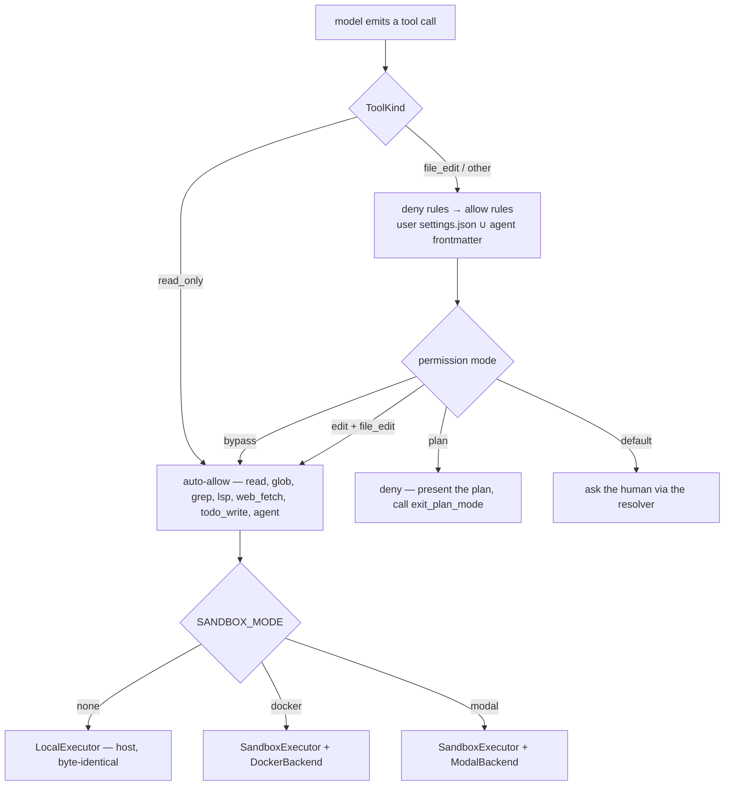
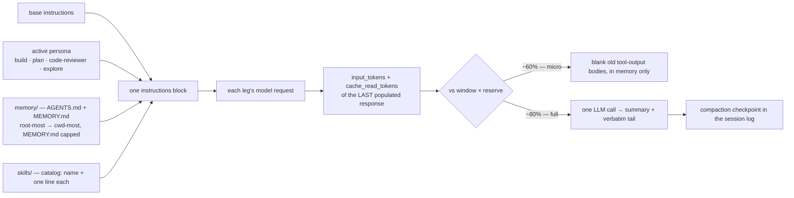

# building-a-coding-agent-from-scratch-course — Architecture

> Clone: `raw/repos/.github-decodingai-magazine-building-a-coding-agent-from-scratch-course/` · [decodingai-magazine/building-a-coding-agent-from-scratch-course](https://github.com/decodingai-magazine/building-a-coding-agent-from-scratch-course) @ `6ee643f`

> Scope: the shipped package `src/decode/` (12.2k lines of Python), plus `README.md`, `AGENTS.md` and `docs/glossary.md`. Deliberately **not read**: `tests/` (~1:1 mirror of `src/`), the `evals/` harness and its 8+ benchmark tasks, `.decode/skills/` demo bodies, `docs/adr/*` (18 ADRs — cited throughout the source docstrings but not opened here), `scripts/`, `docker/`, and the 116 KB rendered `index.html` course site. Inside `src/`, `tui/app.py` and `tools/files.py` were skimmed at outline level only.

## 1. Bird's-eye view

`decode` is a terminal coding agent written as a teaching artifact for an 8-article course. Its thesis, stated in the README: the agent itself is ~20 lines of pydantic-ai, and **everything else — the harness — is what makes a coding agent good**, citing LangChain's Terminal-Bench experiment where swapping only the harness moved a fixed model from ~30th place into the top 5. ([README.md](https://github.com/decodingai-magazine/building-a-coding-agent-from-scratch-course/blob/6ee643fbfeb10d3f9b463bf2a6cdfb64671b8aea/README.md))

Architecturally that becomes **one headless core with two interface modes**: an interactive TUI and a durable headless runtime, both building the *same* `Agent` object through one factory. Every subsystem is a seam with exactly two or three implementations behind it — three LLM providers, three sandbox modes, two runtime entry paths — and the codebase's own rule is that infrastructure is *imported, not abstracted*: `modal`, `opik`, `pydantic-ai` are called directly, and an interface appears only when a second concrete implementation actually arrives. ([AGENTS.md](https://github.com/decodingai-magazine/building-a-coding-agent-from-scratch-course/blob/6ee643fbfeb10d3f9b463bf2a6cdfb64671b8aea/AGENTS.md))



## 2. Layout

- `src/decode/cli.py` — the Click entry point and every startup guard; `decode`, `decode run`, `decode replay`.
- `src/decode/tui/` — the REPL: `app.py` (1020 lines, the largest file — input loop, slash commands, resolvers, key bindings) and `render.py`.
- `src/decode/harness/` — `runner.py` (turn lifecycle, boundaries, cooperative abort) and `queue.py` (steering / follow-up queues).
- `src/decode/agent/` — `factory.py` (builds the `Agent`, owns the provider seam), `loop.py` (the turn handler), `deps.py`, `context_window.py`.
- `src/decode/tools/` — one module per tool plus `registry.py`, the flat single source of truth.
- `src/decode/permissions/` — `gate.py` (policy), `rules.py` (glob matching), `types.py` (modes, tool kinds).
- `src/decode/sandbox/` — `executor.py` (the one executor), `docker_backend.py`, `modal_backend.py`, `workspace.py`, `handback.py`.
- `src/decode/context/` — `compaction.py` and `session_log.py` (append-only JSONL, backs `--resume`).
- `src/decode/memory/`, `src/decode/skills/`, `src/decode/agents/` — the three prompt-assembly sources.
- `src/decode/runtime/` — the Kitaru durable flows and the Modal orchestrator app pin.
- `src/decode/observability/` — Opik/OTLP tracing plus a cost-annotating span exporter.
- `docs/adr/` (18 ADRs), `docs/glossary.md` (~60 canonical terms), `running_the_code/` (9 operator guides), `evals/`, `tasks/`.

## 3. Entry flow

Three commands, one factory. The bare `decode` REPL runs a chain of **startup guards** — environment bucket, provider credentials, context window notice, sandbox backend reachability, `--repo`-under-`none` misconfiguration, unknown agent, unknown mode — each of which prints one friendly stderr line and exits non-zero rather than letting a raw SDK error surface later. ([cli.py#L346-L406](https://github.com/decodingai-magazine/building-a-coding-agent-from-scratch-course/blob/6ee643fbfeb10d3f9b463bf2a6cdfb64671b8aea/src/decode/cli.py#L346-L406))



`build_agent()` is the whole construction story, and it is short on purpose:

```python
    built_model = _build_model(flow_mode=flow_mode, model=model)
    agent: Agent[AgentDeps, str | DeferredToolRequests] = Agent(
        built_model,
        deps_type=AgentDeps,
        output_type=[str, DeferredToolRequests],
        output_retries=3,
        tool_retries=5,
    )
    register_tools(agent)
    _register_instructions(agent)
    set_main_agent(agent)
```

[agent/factory.py#L55-L75](https://github.com/decodingai-magazine/building-a-coding-agent-from-scratch-course/blob/6ee643fbfeb10d3f9b463bf2a6cdfb64671b8aea/src/decode/agent/factory.py#L55-L75)

`output_type=[str, DeferredToolRequests]` is the load-bearing line: a tool that needs approval does not block, it returns a *deferred request*, which is what makes both the permission prompt and mid-turn steering possible. `_build_model` branches on `settings.llm_provider` — Gemini via `GoogleModel`, OpenRouter and self-hosted Modal endpoints both via `OpenAIChatModel` (Modal over a bespoke `AsyncOpenAI` client carrying dual `Modal-Key`/`Modal-Secret` proxy headers). ([factory.py#L107-L141](https://github.com/decodingai-magazine/building-a-coding-agent-from-scratch-course/blob/6ee643fbfeb10d3f9b463bf2a6cdfb64671b8aea/src/decode/agent/factory.py#L107-L141))

**The headless half.** `decode run "<task>"` wraps the same `build_agent()` in a Kitaru `@flow`, checkpointing every model and tool call so a crash re-runs from cache; `--hitl` swaps in a second flow whose gated tools pause on durable waits an operator resolves out of band. Because `model` and `repo` are *flow inputs*, `decode replay <exec_id> --model <other>` re-executes a recorded run from a chosen anchor with the model swapped — the "what-if" the course sells as the reason to have a durable runtime at all. ([runtime/flow.py#L330-L343](https://github.com/decodingai-magazine/building-a-coding-agent-from-scratch-course/blob/6ee643fbfeb10d3f9b463bf2a6cdfb64671b8aea/src/decode/runtime/flow.py#L330-L343))

## 4. The turn: boundaries, legs and steering

This is the subsystem that makes the codebase what it is. A user turn is not one model call — it is a **multi-leg generator** driven by a runner that owns a single-flight phase machine. The turn handler `yield`s a `Boundary` and is *sent back* whatever the runner drained at that boundary.



Two queues, two boundaries, and the distinction between them is the whole design: **steering** (plain `Enter` while busy) is folded into the prompt at the next `MODEL_REQUEST`; **follow-up** (`Alt+Enter`) is drained only at `WOULD_STOP` and buys one more leg. The abort flag is checked at every boundary, never mid-stream and never mid-tool, so `Esc` keeps the history produced so far.

```python
                    steering = yield Boundary.MODEL_REQUEST
                    if pending_results is not None:
                        self._append_steering(steering)
                        output = await self._run_turn(ctx, deferred_results=pending_results)
                        pending_results = None
                    else:
                        prompt = self._compose_prompt(next_prompt, steering)
```

[agent/loop.py#L160-L168](https://github.com/decodingai-magazine/building-a-coding-agent-from-scratch-course/blob/6ee643fbfeb10d3f9b463bf2a6cdfb64671b8aea/src/decode/agent/loop.py#L160-L168)

Two details worth carrying away. The phase is set **synchronously before the first `await`** in `Runner.submit`, so a racing second submission observes "busy" and enqueues instead of starting a second turn ([runner.py#L113-L119](https://github.com/decodingai-magazine/building-a-coding-agent-from-scratch-course/blob/6ee643fbfeb10d3f9b463bf2a6cdfb64671b8aea/src/decode/harness/runner.py#L113-L119)). And the handler *heals* a history whose last message carries tool calls that never got results — a crashed or Esc-aborted leg would otherwise make pydantic-ai reject every subsequent prompt, bricking the session ([loop.py#L212-L243](https://github.com/decodingai-magazine/building-a-coding-agent-from-scratch-course/blob/6ee643fbfeb10d3f9b463bf2a6cdfb64671b8aea/src/decode/agent/loop.py#L212-L243)).

## 5. Tools, the permission gate, and the sandbox seam

Tools are a **flat list of `ToolSpec`**, not a plugin system — 15 entries, each declaring its name, function and `ToolKind` exactly once, with `TOOL_KIND` derived from the same list ([tools/registry.py#L54-L122](https://github.com/decodingai-magazine/building-a-coding-agent-from-scratch-course/blob/6ee643fbfeb10d3f9b463bf2a6cdfb64671b8aea/src/decode/tools/registry.py#L54-L122)). Every tool is registered with a `prepare=` callback that returns `None` when the tool is absent from `ctx.deps.active_agent.tools`, so switching persona narrows the model-facing schema on the next turn with **no agent rebuild**.



The gate is **policy only** — it never prompts. Precedence is deny rules from every source, then allow rules from every source, then the mode × kind matrix, then ask ([permissions/gate.py#L79-L108](https://github.com/decodingai-magazine/building-a-coding-agent-from-scratch-course/blob/6ee643fbfeb10d3f9b463bf2a6cdfb64671b8aea/src/decode/permissions/gate.py#L79-L108)). An `ASK` travels back up to the TUI resolver, and an approved-forever answer persists a rule into `.decode/settings.json`.

Execution sits behind one seam selected once at startup, and the laziness is deliberate — each backend is imported *inside* its own branch so a `none`-mode process never imports Docker or Modal machinery:

```python
def select_executor(mode: str) -> CommandExecutor:
    if mode == "docker":
        from decode.sandbox.docker_backend import DockerBackend
        from decode.sandbox.executor import SandboxExecutor

        return SandboxExecutor(DockerBackend())
    if mode == "modal":
        from decode.sandbox.executor import SandboxExecutor
        from decode.sandbox.modal_backend import ModalBackend

        return SandboxExecutor(ModalBackend())
    from decode.tools.exec import LocalExecutor

    return LocalExecutor()
```

[sandbox/__init__.py#L23-L43](https://github.com/decodingai-magazine/building-a-coding-agent-from-scratch-course/blob/6ee643fbfeb10d3f9b463bf2a6cdfb64671b8aea/src/decode/sandbox/__init__.py#L23-L43)

Two invariants the sandbox layer keeps that are easy to get wrong. **Fresh-exec**: each command is a new process, so `cd` and `export` do not persist across calls while the filesystem does. And **Harness Home vs Workspace**: only the *tool scope* (`deps.cwd`) moves into the sandbox; sessions, `MEMORY.md`, logs, skills and the permission file all stay anchored to the launch directory, which is why a `--resume` still finds its log after a sandbox is destroyed. Work is returned host-side as a `decode/<session-id>` git branch by `sandbox/handback.py`, using ambient host credentials so the sandbox itself never needs one.

**Subagent fan-out.** The `agent` tool is one call that spawns N read-only Explore children concurrently, each a nested `agent.run()` on the *same* `Agent` with narrowed deps (gate in bypass, silent event sink, deny resolvers) so `prepare=` collapses the child toolset to read/glob/grep/lsp and recursion is structurally impossible. Width is capped at 6 prompts, concurrency at a separate semaphore, and quality is enforced deterministically on both sides — a prompt below a word floor is nagged back via `ModelRetry` before any child spawns, and a child that returns an empty report or made zero tool calls buys exactly one re-spawn.

```python
    child_max_bytes = settings.subagent_result_max_bytes // len(prompts)
    sections = await asyncio.gather(
        *(
            _spawn_child(ctx, prompt, index=index, max_bytes=child_max_bytes)
            for index, prompt in enumerate(prompts, start=1)
        )
    )
    fold = "\n\n".join(
        f'## Subagent {index} — "{_label(prompt)}"\n\n{section}'
        for index, (prompt, section) in enumerate(zip(prompts, sections, strict=True), start=1)
    )
    return fold + SYNTHESIS_FOOTER
```

[tools/agent.py#L371-L389](https://github.com/decodingai-magazine/building-a-coding-agent-from-scratch-course/blob/6ee643fbfeb10d3f9b463bf2a6cdfb64671b8aea/src/decode/tools/agent.py#L371-L389)

The fold budget is **shared** — `subagent_result_max_bytes // N` per child — so a 6-wide fan-out costs the parent's context the same as a 1-wide one. There is no synthesis LLM call: the reports are concatenated under labelled headings and a harness-owned footer tells the parent model to be the synthesizer.

## 6. Context engineering: instructions in, compaction out

Four sources join into **one** instructions block, rebuilt fresh every run rather than baked in at construction: the base persona, the active agent's system prompt, the memory files, and the skills catalog. They are joined into a single string because `OpenAIChatModel` emits one `system` message per instruction source and strict OpenAI-compatible servers — vLLM behind a Modal endpoint, some OpenRouter models — reject more than one ([factory.py#L154-L175](https://github.com/decodingai-magazine/building-a-coding-agent-from-scratch-course/blob/6ee643fbfeb10d3f9b463bf2a6cdfb64671b8aea/src/decode/agent/factory.py#L154-L175)).



Skills implement progressive disclosure in three tiers: the catalog (name plus one line) is always in the prompt, the body arrives only when `skill(name)` is called, and a project skill's bundled `references/`, `examples/` and `scripts/` are surfaced as a trailer and read on demand. A project skill overrides a built-in of the same frontmatter `name`; a malformed project skill is warned and skipped while a malformed built-in raises loudly ([skills/catalog.py#L28-L46](https://github.com/decodingai-magazine/building-a-coding-agent-from-scratch-course/blob/6ee643fbfeb10d3f9b463bf2a6cdfb64671b8aea/src/decode/skills/catalog.py#L28-L46), [skills/loader.py#L1-L33](https://github.com/decodingai-magazine/building-a-coding-agent-from-scratch-course/blob/6ee643fbfeb10d3f9b463bf2a6cdfb64671b8aea/src/decode/skills/loader.py#L1-L33)). Catalog lines collapse internal whitespace per field, explicitly so an embedded newline in a project skill's name cannot inject a fake catalog entry.

Compaction is a **two-tier, cheapest-first cascade** checked at `WOULD_STOP`, and the number it reads is the interesting part: the last populated `ModelResponse.usage`, not the run's cumulative usage, because pydantic-ai accumulates across every tool round and would overcount roughly N× for an N-round turn ([loop.py#L65-L79](https://github.com/decodingai-magazine/building-a-coding-agent-from-scratch-course/blob/6ee643fbfeb10d3f9b463bf2a6cdfb64671b8aea/src/decode/agent/loop.py#L65-L79)). Microcompaction blanks old tool outputs in memory only and is never persisted, so a resume replays full fidelity; full compaction replaces history with `[summary, *tail]`, writes a JSONL checkpoint, and returns a three-valued outcome so a fired-but-failed trigger is distinguishable from silence. The cut point is always a *compaction boundary* — a user `ModelRequest` or any `ModelResponse`, never a request carrying a tool return — so a compaction can never orphan a tool call from its result.

## Reading order

1. `README.md` §"The agent is ~20 lines" — the thesis, and the 20-line skeleton the rest of the repo elaborates.
2. `docs/glossary.md` — ~60 canonical terms; read it before the code, because every docstring speaks this vocabulary.
3. `src/decode/agent/factory.py` — the whole construction story in 130 lines.
4. `src/decode/harness/runner.py` then `src/decode/agent/loop.py` — the boundary protocol, then what fills it.
5. `src/decode/tools/registry.py` + `src/decode/permissions/gate.py` — the tool surface and the policy over it.
6. `src/decode/sandbox/__init__.py` + `executor.py` — the seam and its two backends.
7. `src/decode/context/compaction.py`, `src/decode/tools/agent.py`, `src/decode/runtime/flow.py` — the three subsystems that most repay a second read.
8. `AGENTS.md` §"Invariants agents can't infer" — five paragraphs that would take a day to reconstruct from the code.

## Connections

- **Entities**: [[wiki/entities/claude-code]], [[wiki/entities/pydantic-ai]], [[wiki/entities/modal]], [[wiki/entities/opik]], [[wiki/entities/kitaru]]
- **Concepts**: [[wiki/concepts/agent-harness]], [[wiki/concepts/agent-loop]], [[wiki/concepts/permission-gate]], [[wiki/concepts/sandboxing]], [[wiki/concepts/subagents]], [[wiki/concepts/context-compaction]], [[wiki/concepts/agent-memory]], [[wiki/concepts/skills]], [[wiki/concepts/progressive-disclosure]], [[wiki/concepts/durable-execution]], [[wiki/concepts/cli]]

> Synthesis: this is the codebase that makes the wiki's harness talk concrete — where notes and articles assert that skills, memory and permissions matter, `decode` shows the exact seams they occupy, and its explicit debt to Claude Code's leaked source makes it the closest readable reconstruction of that design the wiki has.
