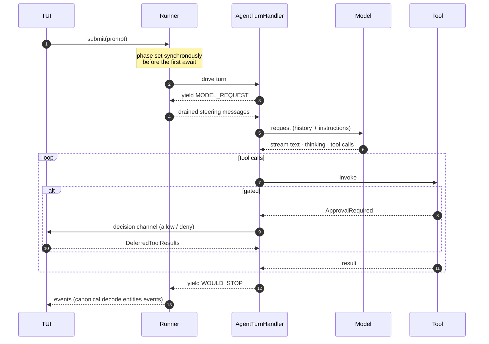
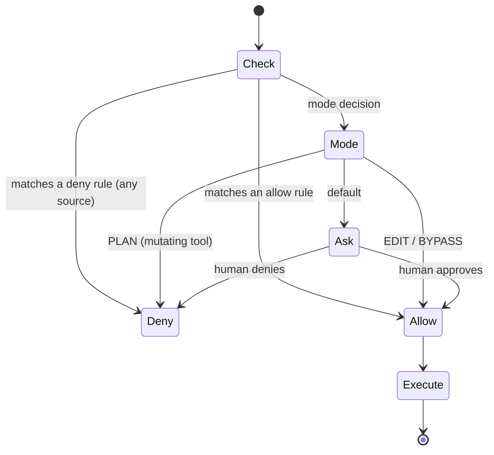

# building-a-coding-agent-from-scratch-course — Architecture

> Clone: `raw/repos/.github-decodingai-magazine-building-a-coding-agent-from-scratch-course/` · [decodingai-magazine/building-a-coding-agent-from-scratch-course](https://github.com/decodingai-magazine/building-a-coding-agent-from-scratch-course) @ `6ee643f`

> Scope: `src/decode/` plus the README — the harness itself. The course prose, the eight
> articles, `evals/`, `tests/` and the 40 MB of demo GIFs in `assets/` are out of scope.

The repo's own framing is the reason it belongs in this wiki: **the agent is ~20 lines and the
course is everything else.** A model, a deps type, an output type, `register_tools`, and an
`agent.iter()` loop. Every other package under `src/decode/` exists to make that loop survivable,
steerable, safe and observable — which is exactly what [[wiki/concepts/agent-harness]] names.

---

## 1. Bird's-eye view

A terminal UI drives a runner; the runner drives one turn handler over a Pydantic-AI agent; tools
reach the outside world through a permission gate and a sandbox.

```mermaid
flowchart LR
    User([👤 terminal]) -->|prompt · steering · Esc| TUI
    subgraph Process["decode process"]
        direction LR
        TUI["`tui/app.py`<br/>render + input intents"] --> Runner["`harness/runner.py`<br/>phase machine, single-flight"]
        Runner --> Loop["`agent/loop.py`<br/>AgentTurnHandler"]
        Loop --> Tools["`tools/registry.py`<br/>flat ToolSpec list"]
        Tools --> Gate["`permissions/gate.py`<br/>deny → allow → mode → ask"]
        Gate --> Sandbox["`sandbox/executor.py`<br/>docker | modal backend"]
        Loop <--> Context["`context/compaction.py`<br/>memory · skills · session log"]
    end
    Loop -->|completions| LLM([🌐 gemini · openrouter · modal])
    Sandbox -->|exec| Workspace([💻 /workspace])
```

The seam worth noticing: the runner does not know it is driving an LLM. It drives a
**turn handler** — an async generator that yields boundaries and receives drained messages —
so the agent loop is pluggable behind it
([`harness/runner.py`](https://github.com/decodingai-magazine/building-a-coding-agent-from-scratch-course/blob/6ee643fbfeb10d3f9b463bf2a6cdfb64671b8aea/src/decode/harness/runner.py)).

---

## 2. Layout

One package per harness concern, and the concerns are the course's chapters.

- `agent/` — the Pydantic-AI turn handler (`loop.py`), the deps object, the model factory, context-window sizing.
- `harness/` — the runner's phase machine, the interaction queues (steering, follow-up, abort), decision routing.
- `tools/` — the flat tool registry plus one module per tool family: files, bash, grep/LSP, skills, subagents, orchestration, ask-user.
- `permissions/` — the gate, the rule sets, the mode types.
- `sandbox/` — one executor over a backend protocol, with docker and modal adapters.
- `context/` — compaction and the JSONL session log.
- `skills/`, `agents/` — the two markdown-defined catalogs (skills; agent personas).
- `memory/` — discovery and assembly of `AGENTS.md` / `MEMORY.md` into instructions.
- `runtime/` — Kitaru durable flows and the Modal app for headless and remote execution.
- `observability/` — Opik tracing, a silent no-op without an API key.
- `tui/`, `cli.py`, `config/`, `entities/`, `services/` — the shell, settings and shared types.

Runtime dependencies are deliberately few — Pydantic AI (slim, two providers), Click, Rich,
prompt-toolkit, httpx, Modal, Kitaru, Logfire — with the heavier integrations added at the course
step that needs them
([`pyproject.toml`](https://github.com/decodingai-magazine/building-a-coding-agent-from-scratch-course/blob/6ee643fbfeb10d3f9b463bf2a6cdfb64671b8aea/pyproject.toml)).

---

## 3. Turn lifecycle

A "turn" is not one model call. It is a multi-leg sequence, held by a single-flight lock, that can
pause for human approval and resume.



- The phase machine is `idle → dispatching → running → idle`, and `DISPATCHING` exists purely so a
  racing second submit observes "busy" *before the first await*.
- **Steering** drains before each model-request leg — typed input reaches the model without
  cancelling the turn.
- **Abort** (`Esc`) stops at the next boundary, never mid-stream or mid-tool, keeping the history
  emitted so far.
- Every gated tool raises `ApprovalRequired`, which is what routes it to the gate; ungated tools
  (`ask_user`, plan-mode controls, `skill`) never reach it
  ([`tools/registry.py`](https://github.com/decodingai-magazine/building-a-coding-agent-from-scratch-course/blob/6ee643fbfeb10d3f9b463bf2a6cdfb64671b8aea/src/decode/tools/registry.py)).

---

## 4. Permissions and sandbox

Policy and execution are separate objects, and the gate never prompts.



Precedence is **deny → allow → mode → ask**, and the two rule sources (user settings and the active
agent's catalog entry) are evaluated as a union: every source's deny list is walked before any allow
list, so a deny anywhere beats an allow anywhere
([`permissions/gate.py`](https://github.com/decodingai-magazine/building-a-coding-agent-from-scratch-course/blob/6ee643fbfeb10d3f9b463bf2a6cdfb64671b8aea/src/decode/permissions/gate.py)).
Plan mode is enforced here rather than by prompt: a mutating tool is denied with a reason that tells
the model to present its plan and call `exit_plan_mode`.

Execution sits behind one `SandboxExecutor` over a thin backend protocol with docker and Modal
adapters. The model is **fresh-exec, one sandbox per session**: the filesystem persists, but each
command is a new process, so `cd` and `export` do not carry over, and every command runs in
`/workspace`
([`sandbox/executor.py`](https://github.com/decodingai-magazine/building-a-coding-agent-from-scratch-course/blob/6ee643fbfeb10d3f9b463bf2a6cdfb64671b8aea/src/decode/sandbox/executor.py)).

---

## 5. Context: skills, memory, compaction

Three mechanisms decide what the model sees, and all three are markdown-first.

```mermaid
flowchart TB
    subgraph Instructions["assembled per turn"]
        Memory["`memory/service.py`<br/>AGENTS.md · MEMORY.md<br/>root-most → cwd-most"]
        Persona["`agents/loader.py`<br/>builtin/*.md personas<br/>name · tools · mode · allow/deny"]
        Skills["`skills/loader.py`<br/>&lt;name&gt;/SKILL.md<br/>builtin + project (project wins)"]
    end
    Instructions --> Window["`agent/context_window.py`"]
    Window --> Trigger{"over reserve<br/>threshold?"}
    Trigger -->|no| Continue[continue turn]
    Trigger -->|micro| Micro["`microcompact`<br/>in-memory, no LLM"]
    Trigger -->|full| Full["`summarize_for_compaction`<br/>LLM summary + tail"]
    Micro --> Continue
    Full --> Continue
```

- **Skills** are exactly the convention the notes in this wiki describe: a directory with a
  `SKILL.md`, YAML frontmatter (`name`, `description`) and an instruction body. Built-ins load as
  packaged data and fail loudly; project skills are skipped with a warning when malformed, "a user's
  typo never breaks a session", and a same-name project skill overrides the built-in
  ([`skills/loader.py`](https://github.com/decodingai-magazine/building-a-coding-agent-from-scratch-course/blob/6ee643fbfeb10d3f9b463bf2a6cdfb64671b8aea/src/decode/skills/loader.py)).
- **Memory** is two files with different trust levels: `AGENTS.md` is project-authored and trusted;
  `MEMORY.md` is model-maintained and therefore capped. Each is injected with a provenance header,
  most specific last
  ([`memory/service.py`](https://github.com/decodingai-magazine/building-a-coding-agent-from-scratch-course/blob/6ee643fbfeb10d3f9b463bf2a6cdfb64671b8aea/src/decode/memory/service.py)).
- **Compaction** has two tiers — a no-LLM microcompaction and a full LLM summary — and the tail cut
  snaps to a boundary so a tool-call/result pair is never split. Microcompaction is in-memory only:
  the JSONL session log keeps full fidelity
  ([`context/compaction.py`](https://github.com/decodingai-magazine/building-a-coding-agent-from-scratch-course/blob/6ee643fbfeb10d3f9b463bf2a6cdfb64671b8aea/src/decode/context/compaction.py)).

---

## 6. Headless and remote runtime

The same `build_agent()` runs interactively and autonomously. `runtime/flow.py` wraps it in two
durable flows: one that bypasses gating entirely (no human to wait for) and one that pauses
`write` / `edit` / `bash` and `ask_user` on durable waits resolved out of band. **Each turn is
checkpointed, so a crash replays finished turns from cache** — the same result-caching argument the
notes in this wiki make about ingestion pipelines, applied to an agent loop
([`runtime/flow.py`](https://github.com/decodingai-magazine/building-a-coding-agent-from-scratch-course/blob/6ee643fbfeb10d3f9b463bf2a6cdfb64671b8aea/src/decode/runtime/flow.py)).

Inference is provider-agnostic by construction: `build_model(settings.llm_provider)` selects between
a hosted API, an open-weights gateway and a self-served model on serverless GPUs — the three tiers
[[wiki/concepts/inference-economics]] describes, behind the one interface
[[wiki/concepts/provider-abstraction]] argues for.

## Reading order

1. `README.md` — the ~20-line agent, and what counts as "the harness".
2. [`agent/loop.py`](https://github.com/decodingai-magazine/building-a-coding-agent-from-scratch-course/blob/6ee643fbfeb10d3f9b463bf2a6cdfb64671b8aea/src/decode/agent/loop.py) — the turn handler; the whole system's centre of gravity.
3. [`harness/runner.py`](https://github.com/decodingai-magazine/building-a-coding-agent-from-scratch-course/blob/6ee643fbfeb10d3f9b463bf2a6cdfb64671b8aea/src/decode/harness/runner.py) — phases, steering, abort.
4. [`tools/registry.py`](https://github.com/decodingai-magazine/building-a-coding-agent-from-scratch-course/blob/6ee643fbfeb10d3f9b463bf2a6cdfb64671b8aea/src/decode/tools/registry.py) → `permissions/gate.py` → `sandbox/executor.py` — how a tool call reaches the disk.
5. `docs/adr/` — the decision records the module docstrings cite by number.

## Connections

- **Entities**: [[wiki/entities/claude-code]], [[wiki/entities/modal]]
- **Concepts**: [[wiki/concepts/agent-harness]], [[wiki/concepts/agent-skills]], [[wiki/concepts/durable-execution]], [[wiki/concepts/provider-abstraction]], [[wiki/concepts/inference-economics]], [[wiki/concepts/context-rot]], [[wiki/concepts/agent-memory]], [[wiki/concepts/agentic-coding-loop]]

> Synthesis: This codebase is the wiki's only source where the harness claims are *executable* rather than asserted — and the correspondence is close enough to be useful: skills as folders with a `SKILL.md`, compaction as the answer to context rot, per-turn checkpointing as durability, and one provider seam over three payment models.
