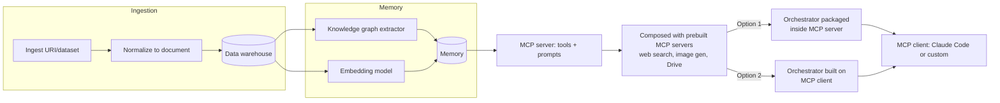

# The Right Way of Building Agents With MCP Servers

> [[raw/the-right-way-of-building-agents-with-mcp-servers|Raw]] · local

## Summary

This is a talked-through draft (addressed to "Curtis," apparently for a book) of an
architecture for agents built around MCP servers, framed explicitly as an open
question rather than a settled answer. The author first walks through what he calls
his "go-to" baseline: a data pipeline that ingests a dataset or URI and normalizes it
into documents, feeding a memory pipeline that extracts a knowledge graph
(entities/relationships), computes embeddings over document summaries, and attaches
metadata (source, author, dates). That memory is exposed through an MCP server as a
small set of tools (knowledge-graph search, knowledge-graph write) and "prompts" —
predefined procedures such as "update episodic memory," "write technical article,"
and "write social media post" — that tell an orchestrator how to combine the tools.

The note then works through composition: the custom MCP server is combined with
prebuilt MCP servers (web search, image generation, Google Drive search) into one set
of composed tools and prompts, which an MCP client then drives — either a custom
orchestrator built on FastMCP, or a pre-built orchestrator like Claude Code. The
tooling stack pins Prefect to every pipeline (data, memory, retrieval) and FastMCP to
both the server and the client-side connection.

The actual point of the note, though, is a single unresolved architectural question:
should a custom orchestrator be packaged *inside* the MCP server (exposed as one tool
that any client, including Claude Code, can call), or built on the MCP client side
against the raw exposed tools and prompts? The author says he has implemented both
and cannot yet choose between them, and treats the choice as consequential because it
determines where the client itself can live (a Python/FastAPI backend, a TypeScript
frontend, or Claude Code directly).

## Key claims

- The data pipeline ingests a dataset or URI and normalizes it into a document saved
  to a data warehouse; the memory pipeline then turns those documents into knowledge-graph
  objects (entities/relationships) plus summary embeddings and metadata (source,
  author, dates), and saves the result to memory. [[raw/the-right-way-of-building-agents-with-mcp-servers|cite]]
- The MCP server exposes memory access as tools (knowledge-graph search,
  knowledge-graph write) and as "prompts" — predefined procedures like "update
  episodic memory," "write technical article," and "write social media post" — that
  tell the orchestrator which tools to combine and how. [[raw/the-right-way-of-building-agents-with-mcp-servers|cite]]
- Episodic memory (what a specific user did at a moment, e.g. "celebrated New Year's
  Eve in the mountains in December 2025") is distinguished from semantic memory
  (general preferences, e.g. writing or style preferences). [[raw/the-right-way-of-building-agents-with-mcp-servers|cite]]
- The custom MCP server is composed with prebuilt MCP servers (web search, image
  generation, Google Drive search) so the agent can reach functionality the author
  does not want to implement himself. [[raw/the-right-way-of-building-agents-with-mcp-servers|cite]]
- Two architectural options are laid out for where a custom orchestrator should live:
  packaged inside the MCP server and exposed as a single tool (so any client,
  including a pre-built one like Claude Code, can call it), or built on the MCP
  client side against the raw exposed tools and prompts — the author states he has
  implemented both and cannot yet choose which is architecturally better. [[raw/the-right-way-of-building-agents-with-mcp-servers|cite]]
- On tooling, Prefect orchestrates the data, memory, and retrieval pipelines, and
  FastMCP implements both the MCP server and the client-side connection to it. [[raw/the-right-way-of-building-agents-with-mcp-servers|cite]]

## Notable quotes

> "The real question here is: where should we put this custom orchestrator? Should we
> put it on the MCP server side, or should we put it on the client side?"
> — [[raw/the-right-way-of-building-agents-with-mcp-servers|location]]

> "Programmatically, both work—I implemented both. But from the architectural system
> design point of view, which solution is better? I cannot really choose, and I think
> it's a very important architectural decision that propagates through the entire
> application."
> — [[raw/the-right-way-of-building-agents-with-mcp-servers|location]]

## Connections

- **Entities**: [[wiki/entities/fastmcp]], [[wiki/entities/prefect]], [[wiki/entities/claude-code]]
- **Concepts**: [[wiki/concepts/mcp]], [[wiki/concepts/knowledge-graph]], [[wiki/concepts/agent-memory]], [[wiki/concepts/orchestrator-placement]]

> Synthesis: This is a working draft, not a conclusion — the author explicitly frames
> the server-side-vs-client-side orchestrator placement as an open question he wants
> feedback on, so it should be read as a design problem statement rather than a
> recommended pattern.
