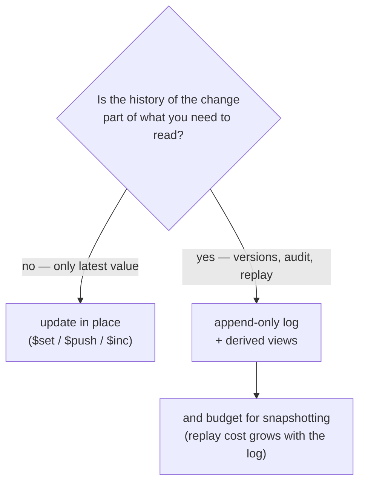

# Append-only logs vs. in-place updates

The wiki has no general database-design source. What it has is two working systems
that made the choice deliberately, one that made it **both ways inside a single
cluster**, and one personal knowledge graph that quietly declined it — enough to
separate the rule from the scale it is usually confused with.

## The rule the sources actually apply

The MongoDB memory architecture splits an agent's state into four layers and picks
a different write regime for each. Per-user/session **operational** state is updated
in place with atomic `$set` / `$push` / `$inc`. **Knowledge-graph** state, in the
same cluster, is event-sourced: changes append to an immutable `kg_events`
collection and current state is derived through aggregation-pipeline views
(`$sort`, `$group`, `$last`). [[wiki/sources/mongodb-for-an-ai-agent-unified-memory]],
[[wiki/entities/mongodb]]

What separates them: for session state, only the latest value is ever read. For the
graph, *how it got here* is part of what the system is for — [[wiki/concepts/graphrag]]
records it as a graph that is replayed rather than "mutated in place." Once you need
"what did this look like last Tuesday, and what changed it," an in-place update has
already destroyed the answer.

## The second witness: a log because it must survive a crash

`decode` persists session state as an **append-only per-session JSONL log instead of
a database**, because that log backs `--resume`.
[[wiki/sources/article-the-coding-agent-loop]],
[[wiki/repos/github-decodingai-magazine-building-a-coding-agent-from-scratch-course/ARCHITECTURE]]

Its compaction design shows the discipline the format demands. Microcompaction blanks
old tool outputs **in memory only, never persisted**, so a resume replays full history.
Full compaction — a genuinely destructive rewrite of history to `[summary, *tail]` —
does not rewrite the log either; it *appends a checkpoint record*, so the rewrite
survives as an event rather than as a hole. [[wiki/concepts/context-compaction]]
Destructive operations become entries. That is what keeps the log trustworthy under a
process built to throw information away.

## What it costs

- **Replay cost grows with the log.** The stated mitigation is periodic snapshotting,
  "to avoid full log replay." [[wiki/sources/mongodb-for-an-ai-agent-unified-memory]]
  Without it, the read path degrades without bound.
- **Current state is derived, not stored.** Every read pays an aggregation-pipeline
  materialization that a row read does not. [[wiki/concepts/graphrag]]

## Does a personal knowledge graph clear the bar?

On the wiki's own evidence, usually not — and the deciding factor is not size.

The wiki holds exactly one personal knowledge graph built end to end: the "digital
twin" memory system of [[wiki/sources/agentic-graphrag-via-mcp-servers]] — five ETL
pipelines, an LLM+rules extraction pipeline, one `knowledge_graph` collection of typed
nodes and edges. Its report covers data model, ingestion and three retrieval strategies
in detail and **describes no event log and no versioning**; [[wiki/concepts/knowledge-graph]]
records none either. Where it does hit a "this state changes later" problem it solves it
in place: a referenced-but-not-yet-ingested URL is stored as a `LATENT` placeholder and
**upgraded with real content** when the real ingest arrives — exactly the mutation an
event log would have kept as two entries.

That is worth more than a shrug, because by the wiki's own synthesis lines the MongoDB
note and this build report read as the same author's project from two angles
([[wiki/entities/mongodb]], [[wiki/concepts/graphrag]]). `kg_events` is the
recommendation; the graph that actually got built is the practice.

Cost explains it. Event sourcing does not get cheaper at personal scale — the machinery
is fixed, not proportional. You owe snapshotting whether the log holds 10k events or
10M, and one user amortizes it.

The condition that flips the call is **who writes**, not how much. The same build report
runs a `Stop` hook that auto-ingests each conversation once per session, framed as a
self-sustaining loop growing the graph "without any deliberate user action."
[[wiki/sources/agentic-graphrag-via-mcp-servers]] An LLM+rules extractor mutating your
graph unattended is precisely the fallible destructive writer that `decode`'s checkpoint
discipline exists to survive. [[wiki/concepts/context-compaction]] If you cannot answer
"what did the extractor do to my graph last Tuesday, and can I undo it," that is the
case for the log — a case about trusting an automated writer, not about scale.

> Synthesis: the strongest evidence here is negative and circumstantial — one builder
> recommending `kg_events` in an architecture note and not building it in their own
> graph. `[[wiki/concepts/event-sourcing]]` is still a promissory link at one mention,
> and nothing in the wiki reports the *maintenance* cost of running an event-sourced
> graph over time, which is the number that would settle this. A source that ran one
> and reported back would revise this note more than another architecture argument would.
