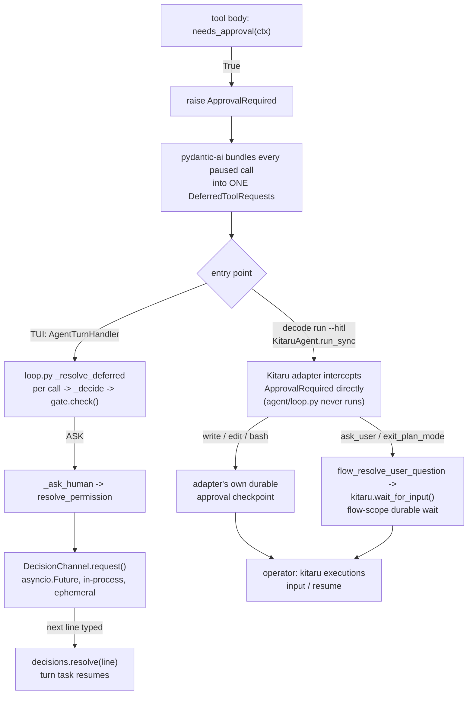

# Tool call routing to the permission gate

> Answers [[wiki/questions/2026-08-31-tool-call-routing-to-the-permission-gate]] against `building-a-coding-agent-from-scratch-course` @ `6ee643f`

`ARCHITECTURE.md` already covers the gate's policy matrix and sketches the deferred-resume shape. This note fills the two things it doesn't: the exact call path from a tool body to `gate.check()`, and the mechanics of the wait itself — in the interactive TUI and under headless `--hitl`, which turn out to be two structurally different mechanisms, not one durable version of the other.

## Answer

**How a call becomes `DeferredToolRequests`.** Every gated tool's body — `read`, `write`, `edit`, `glob`, `bash`, etc. — opens with the same guard, regardless of `ToolKind`: `if needs_approval(ctx): raise ApprovalRequired`. `needs_approval` (`tools/approval.py:20-42`) is `False` only when the call is already approved or `gate.mode is BYPASS`; otherwise every tool defers, read-only ones included — the "auto-allow" for read-only kinds happens *inside* `gate.check()`, not by skipping the deferred path. pydantic-ai catches `ApprovalRequired` across a whole tool round and resolves the leg's output to one `DeferredToolRequests` bundling every paused call in that round, not one per call.

**Where `gate.check()` actually runs.** `AgentTurnHandler.__call__`'s per-leg check `isinstance(output, DeferredToolRequests)` (`agent/loop.py:182`) does not call the gate directly — it hands the whole bundle to `_resolve_deferred` (`loop.py:429-443`), which loops `requests.approvals` and calls `_decide` (`loop.py:445-468`) once per pending call. `_decide` builds a `PermissionRequest` (kind + subject) and **that** is the line that calls `self._deps.gate.check(request)` (`loop.py:459`) — synchronous, in-process, one call per pending tool call. ALLOW/DENY resolve immediately inside `_decide`; only ASK reaches `_ask_human` (`loop.py:470-489`), which emits `PermissionRequested` and `await self._deps.resolve_permission(request)`.

**What suspends while ASK waits (TUI).** The TUI's `resolve_permission` (`_make_permission_resolver`, `tui/app.py:500-527`) prints the one-line affordance and awaits `channel.request()` on a `DecisionChannel` (`harness/decisions.py`) — a fresh `asyncio.Future[str]` created per request. So the thing actually suspended is the **Runner's own turn task**, parked deep inside `await agen.asend(sent)` (`harness/runner.py:153`) — mid-frame inside the whole multi-leg turn coroutine, not at a yielded `Boundary`. `runner.phase` stays `RUNNING` for the entire wait; the footer only knows to hide its spinner because it separately checks `decisions.pending` (`tui/app.py:592`).

**Pending state is exactly one Future**, owned by the single `DecisionChannel` the TUI session constructs once (`decisions = DecisionChannel()`, `tui/app.py:781`). Nothing is persisted or checkpointed; a process crash loses it outright. The channel's own docstring states the invariant that makes this safe: only one decision is ever pending at a time, guaranteed by the Runner's single-flight lock.

**What happens to steering/follow-up/abort during the wait.** The REPL's main loop checks `decisions.pending` *before* it inspects intent (`tui/app.py:929`):

```python
if decisions.pending:
    logger.debug("decision pending: routing %r to the decision channel", text)
    decisions.resolve(text)
    continue
```
([tui/app.py#L927-L932](https://github.com/decodingai-magazine/building-a-coding-agent-from-scratch-course/blob/6ee643fbfeb10d3f9b463bf2a6cdfb64671b8aea/src/decode/tui/app.py#L927-L932))

So the very next submitted line — whatever produced it — goes to `decisions.resolve()`, never to `runner.submit()`. The steering and follow-up queues (`InteractionQueues`) cannot receive anything while an ask is open: there is no way to type steering text mid-ask, the single input surface is entirely captured by the decision. Esc doesn't reach `runner.abort()` either: its key binding just exits with `(ABORT, buffer.text)` (`tui/app.py:616-618`), and because the `decisions.pending` branch is checked first, that (usually empty) buffer text is parsed by `parse_permission_answer` — which denies anything that isn't `y`/`yes`/`allow`/`a`/`always`. **Esc during a permission ask denies the tool call; it does not abort the turn.** `decisions.cancel()` — the thing that actually unblocks a resolver into its deny default — only fires once, on REPL shutdown (`tui/app.py:996`), right before `await runner.wait_idle()`.

**Headless `--hitl` is not a durable version of the same channel — it's different plumbing entirely.** `run_agent_task` / `run_agent_task_hitl` (`runtime/flow.py`) never construct an `AgentTurnHandler` or `Runner`; they call `KitaruAgent(...).run_sync(task, deps=deps)` directly, so `agent/loop.py`'s boundary generator, queues, and `DecisionChannel` play no part at all in a headless run. Two separate waits stand in their place:

- `ask_user` / `exit_plan_mode` route through `flow_resolve_user_question` (`runtime/flow.py:388-402`), which calls Kitaru's own `wait_for_input(question=..., name=_hitl_wait_name(question), schema=str, timeout=settings.runtime_wait_timeout_s)` — a genuine **durable, flow-scope Kitaru wait/checkpoint**, not an in-memory `Future`. It can outlive the process and carries an explicit timeout.
- `write` / `edit` / `bash` approvals bypass decode's gate/resolver machinery for real. `_build_hitl_deps` (`runtime/flow.py:429-448`) still constructs `PermissionGate(mode=PermissionMode.DEFAULT)` and wires `resolve_permission=_deny_permission_resolver`, but its own docstring calls that resolver a "deny safety-net... the adapter resolves approvals natively." The `KitaruAgent` wrapper (external to this repo, `kitaru.adapters.pydantic_ai`) intercepts `ApprovalRequired` itself, because these tools are opted **out** of their per-call checkpoint under `checkpoint_strategy="calls"` (`_to_hitl_durable_agent`, `runtime/flow.py:405-419`) — hoisting the wait to flow scope. A denial surfaces as `_ToolApprovalDenied` raised straight out of `run_sync` (`runtime/flow.py:483-487`), which decode catches and ends the run with a fixed message — there is no feed-the-denial-back-to-the-model continuation the way `ToolDenied` gives the TUI path.

Both HITL waits resolve the same way: the CLI treats a pause as a normal, exit-0 outcome and prints the operator recipe instead of blocking a terminal (`cli.py:554-566`) — `kitaru executions input <exec_id> --wait <name> --value '<answer>'` then `kitaru executions resume <exec_id>`.



## Evidence

- `src/decode/tools/approval.py:20-42` — `needs_approval`: gates every non-approved, non-BYPASS call regardless of kind; special-cases `headless_durable_waits` to apply the read-only-allow floor itself. ([permalink](https://github.com/decodingai-magazine/building-a-coding-agent-from-scratch-course/blob/6ee643fbfeb10d3f9b463bf2a6cdfb64671b8aea/src/decode/tools/approval.py#L20-L42))
- `src/decode/tools/files.py:189-191` — a representative gated tool body raising `ApprovalRequired`. ([permalink](https://github.com/decodingai-magazine/building-a-coding-agent-from-scratch-course/blob/6ee643fbfeb10d3f9b463bf2a6cdfb64671b8aea/src/decode/tools/files.py#L189-L191))
- `src/decode/agent/loop.py:182-185` — the `isinstance(output, DeferredToolRequests)` dispatch into `_resolve_deferred`. ([permalink](https://github.com/decodingai-magazine/building-a-coding-agent-from-scratch-course/blob/6ee643fbfeb10d3f9b463bf2a6cdfb64671b8aea/src/decode/agent/loop.py#L182-L185))
- `src/decode/agent/loop.py:429-468` — `_resolve_deferred` and `_decide`; `gate.check(request)` at line 459. ([permalink](https://github.com/decodingai-magazine/building-a-coding-agent-from-scratch-course/blob/6ee643fbfeb10d3f9b463bf2a6cdfb64671b8aea/src/decode/agent/loop.py#L429-L468))
- `src/decode/agent/loop.py:470-489` — `_ask_human`: emits `PermissionRequested`, awaits `resolve_permission`. ([permalink](https://github.com/decodingai-magazine/building-a-coding-agent-from-scratch-course/blob/6ee643fbfeb10d3f9b463bf2a6cdfb64671b8aea/src/decode/agent/loop.py#L470-L489))
- `src/decode/harness/decisions.py:1-79` — `DecisionChannel`: single-pending-future contract, `request`/`resolve`/`cancel`. ([permalink](https://github.com/decodingai-magazine/building-a-coding-agent-from-scratch-course/blob/6ee643fbfeb10d3f9b463bf2a6cdfb64671b8aea/src/decode/harness/decisions.py#L1-L79))
- `src/decode/tui/app.py:500-527` — `_make_permission_resolver`, the TUI's `resolve_permission` implementation. ([permalink](https://github.com/decodingai-magazine/building-a-coding-agent-from-scratch-course/blob/6ee643fbfeb10d3f9b463bf2a6cdfb64671b8aea/src/decode/tui/app.py#L500-L527))
- `src/decode/tui/app.py:918-996` — the REPL loop: `decisions.pending` routed before intent (927-932), Esc's `(ABORT, text)` result and key binding (616-618, 937-940), shutdown `decisions.cancel()` (996). ([permalink](https://github.com/decodingai-magazine/building-a-coding-agent-from-scratch-course/blob/6ee643fbfeb10d3f9b463bf2a6cdfb64671b8aea/src/decode/tui/app.py#L918-L996))
- `src/decode/harness/runner.py:131-167` — `Runner._run_turn`: the turn task's `await agen.asend(sent)` is the actual suspension point; phase stays `RUNNING` throughout. ([permalink](https://github.com/decodingai-magazine/building-a-coding-agent-from-scratch-course/blob/6ee643fbfeb10d3f9b463bf2a6cdfb64671b8aea/src/decode/harness/runner.py#L131-L167))
- `src/decode/runtime/flow.py:373-419` — `flow_resolve_user_question` / `_hitl_wait_name` / `_to_hitl_durable_agent`: the durable `wait_for_input` call and the checkpoint opt-out that hoists tool waits to flow scope. ([permalink](https://github.com/decodingai-magazine/building-a-coding-agent-from-scratch-course/blob/6ee643fbfeb10d3f9b463bf2a6cdfb64671b8aea/src/decode/runtime/flow.py#L373-L419))
- `src/decode/runtime/flow.py:429-498` — `_build_hitl_deps` (resolver as safety-net only) and `run_agent_task_hitl` (`run_sync`, `_ToolApprovalDenied` handling). ([permalink](https://github.com/decodingai-magazine/building-a-coding-agent-from-scratch-course/blob/6ee643fbfeb10d3f9b463bf2a6cdfb64671b8aea/src/decode/runtime/flow.py#L429-L498))
- `src/decode/runtime/flow.py:501-549` — `HitlRunResult` / `run_hitl_agent_task`: `paused=True` semantics, per-wait-kind timeout note. ([permalink](https://github.com/decodingai-magazine/building-a-coding-agent-from-scratch-course/blob/6ee643fbfeb10d3f9b463bf2a6cdfb64671b8aea/src/decode/runtime/flow.py#L501-L549))
- `src/decode/cli.py:538-573` — `_run_hitl`: prints the `kitaru executions input` / `resume` recipe on a pause, exit code 0. ([permalink](https://github.com/decodingai-magazine/building-a-coding-agent-from-scratch-course/blob/6ee643fbfeb10d3f9b463bf2a6cdfb64671b8aea/src/decode/cli.py#L538-L573))

Not read for this note: the `kitaru.adapters.pydantic_ai` package itself (external library — its `_toolset` module and the shape of its own durable approval checkpoint are inferred from decode's docstrings and usage, not opened directly), `tools/bash.py` and the other gated tool bodies beyond the one cited (same `needs_approval` guard, confirmed by grep, not each individually read), and `entities/permissions.py` / `entities/events.py` (the `PermissionRequest`/`PermissionDecision`/`PermissionRequested` dataclasses — shape assumed from call sites).

## Connections

- **Entities**: [[wiki/entities/kitaru]], [[wiki/entities/pydantic-ai]]
- **Concepts**: [[wiki/concepts/permission-gate]], [[wiki/concepts/agent-loop]], [[wiki/concepts/agent-harness]]

> Synthesis: the gate itself is pure policy (per ARCHITECTURE.md); this note is about the two very different waiting rooms decode builds around it — an ephemeral in-process `Future` that owns the TUI's one input surface outright, versus a Kitaru durable checkpoint that a human resolves from an entirely separate terminal — both converging on the same `ApprovalRequired`/`DeferredToolRequests` pydantic-ai primitive at the tool boundary.
