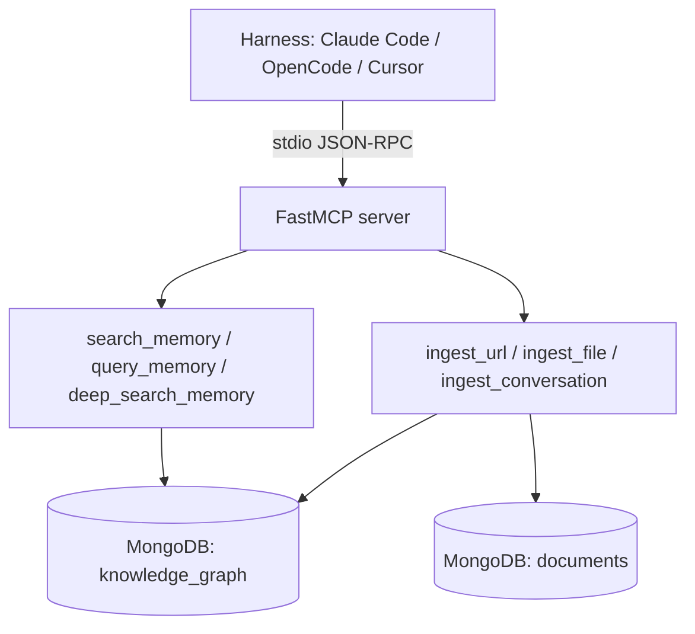

# Agentic GraphRAG via MCP Servers

> [[03-llm-wiki-interactive/examples/wiki-ai-engineering-after/raw/agentic-graphrag-via-mcp-servers|Raw]] · local

## Summary

An end-to-end architecture report for a personal "digital twin" memory system: five ETL pipelines normalize heterogeneous sources into one MongoDB `documents` collection, an LLM+rules extraction pipeline turns that content into a single-collection knowledge graph of typed nodes and edges, and three query strategies read it back with different precision/breadth trade-offs. The report's center of gravity, though, is the delivery layer — how that memory is exposed as a FastMCP server and wired into Claude Code (and, in principle, any MCP-compatible harness) via six thin tool wrappers that add zero business logic of their own.

Its argument is that an MCP integration naturally splits into three layers of decreasing portability: the MCP server itself (universal), skills (harness-specific tool-selection guidance), and hooks (harness-specific automation like auto-ingesting a conversation on session end). Only Claude Code, in this report, has all three.

## Key claims

- All five source pipelines (Substack RSS, Substack articles, ArXiv via HuggingFace, local files, conversations) implement a common `BaseETL` contract and land in one `documents` collection; a referenced-but-not-yet-ingested URL is stored as a `LATENT` placeholder document that gets upgraded with real content once it is later ingested. [[03-llm-wiki-interactive/examples/wiki-ai-engineering-after/raw/agentic-graphrag-via-mcp-servers#1. Data Pipelines (ETL Layer)|cite]]
- Nodes and edges live together in a single `knowledge_graph` MongoDB collection, discriminated by a `kind` field and addressed by composite string IDs (`person:paul iusztin`), specifically so `$graphLookup` can do multi-hop traversal without joining across collections. [[03-llm-wiki-interactive/examples/wiki-ai-engineering-after/raw/agentic-graphrag-via-mcp-servers#3. Knowledge Graph Data Model|cite]]
- Three query strategies exist because no single one covers every question shape: `search_memory` fuses vector and text search via Reciprocal Rank Fusion then expands one hop as the forgiving default; `query_memory` has an LLM translate natural language into a validated (write-blocked, whitelisted) MongoDB aggregation pipeline for counts and precise filters, with one self-correction retry on error; `deep_search_memory` runs a much wider search and writes results to disk as individual files plus a YAML index, so the harness reads only what it needs. [[03-llm-wiki-interactive/examples/wiki-ai-engineering-after/raw/agentic-graphrag-via-mcp-servers#5. Query Logic (3 Strategies)|cite]]
- Every MCP tool is a thin delegate — extract lifespan context, call an existing business-logic function, strip the embedding field, return a string — so the same extraction/query code path runs whether it's triggered by a real-time MCP call or a batch Prefect flow. [[03-llm-wiki-interactive/examples/wiki-ai-engineering-after/raw/agentic-graphrag-via-mcp-servers#6. Building the GraphRAG FastMCP Server|cite]]
- The report generalizes its own setup into a 3-layer pattern for connecting any MCP server to any harness: Layer 1 (the MCP server — tools, instructions, transport) is protocol-standard and works everywhere; Layer 2 (skills) and Layer 3 (hooks) are Claude-Code-specific progressive enhancements that other harnesses (OpenCode, Cursor, Windsurf) simply don't get, falling back to tool docstrings alone. [[03-llm-wiki-interactive/examples/wiki-ai-engineering-after/raw/agentic-graphrag-via-mcp-servers#9. Hooking the MCP Server to a Harness (Claude Code, OpenCode, etc.)|cite]]
- A `Stop` hook auto-ingests each Claude Code conversation once per session (via a sentinel file that blocks the turn with an instruction to run the ingestion skill), which the report frames as a self-sustaining loop that grows the graph without any deliberate user action. [[03-llm-wiki-interactive/examples/wiki-ai-engineering-after/raw/agentic-graphrag-via-mcp-servers#9. Hooking the MCP Server to a Harness (Claude Code, OpenCode, etc.)|cite]]

## Notable quotes

> "The MCP layer is a delivery mechanism, not a logic layer."
> — [[03-llm-wiki-interactive/examples/wiki-ai-engineering-after/raw/agentic-graphrag-via-mcp-servers#6. Building the GraphRAG FastMCP Server|location]]

> "Layer 1 is portable. Layers 2 and 3 are progressive enhancements that make the experience richer in harnesses that support them, while degrading gracefully in those that don't."
> — [[03-llm-wiki-interactive/examples/wiki-ai-engineering-after/raw/agentic-graphrag-via-mcp-servers#9. Hooking the MCP Server to a Harness (Claude Code, OpenCode, etc.)|location]]

## Connections

- **Entities**: [[03-llm-wiki-interactive/examples/wiki-ai-engineering-after/wiki/entities/fastmcp]], [[03-llm-wiki-interactive/examples/wiki-ai-engineering-after/wiki/entities/claude-code]], [[03-llm-wiki-interactive/examples/wiki-ai-engineering-after/wiki/entities/mongodb]]
- **Concepts**: [[03-llm-wiki-interactive/examples/wiki-ai-engineering-after/wiki/concepts/graphrag]], [[03-llm-wiki-interactive/examples/wiki-ai-engineering-after/wiki/concepts/knowledge-graph]], [[03-llm-wiki-interactive/examples/wiki-ai-engineering-after/wiki/concepts/mcp]], [[03-llm-wiki-interactive/examples/wiki-ai-engineering-after/wiki/concepts/progressive-disclosure]], [[wiki/concepts/hybrid-search]]

> Synthesis: First source in this wiki, so every claim here is currently a single witness — a builder's own report on a system they built, strong on implementation detail but not yet corroborated; GraphRAG, progressive disclosure and hybrid search are the concepts most likely to gain a second, independent source.
