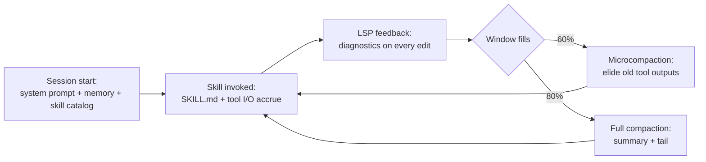

# Context Engineering for Coding Agents

> [[raw/article-context-engineering-for-coding-agents|Raw]] · article · Paul Iusztin, 2026-08-25

## Summary

Lesson 4 of the open-source course *Building a Coding Agent From Scratch*, in which the author builds **Decode**, a Python coding agent, lesson by lesson. The framing claim: the harness, not the underlying model, decides whether a coding agent is good, backed by LangChain's Terminal-Bench result of a ~30th-to-top-5 jump from a harness change alone with the same model. The lesson walks one real demo session (`demo-5-sandbox-feature-pr`, where Decode spawns a sandboxed subagent to write a feature and open a PR) to show how four context-engineering components cooperate across a session's life: **memory** (a hand-written `AGENTS.md` plus an auto-extracted `.decode/MEMORY.md`), **skills** (loaded through three tiers of progressive disclosure), an **LSP server** (`ty`, feeding the agent through an on-demand tool and a passive diagnostics channel), and **compaction** (`/clear`, full compaction, microcompaction).

Each section pairs a concrete failure from the author's own agent runs — retyping the same datetime/type-hint corrections every session, review guides bloating `AGENTS.md`, a 15-minute multi-agent test loop, Gemini degrading well before its stated token ceiling — with the exact code in Decode's source tree that fixes it.

> Synthesis: This is lesson 4 of an 8-lesson course whose earlier lessons cover harness engineering and the sandboxed agent loop (not yet in this wiki); the piece explicitly anchors its thesis in [Anthropic's context-engineering framing](https://www.anthropic.com/engineering/effective-context-engineering-for-ai-agents) rather than originating it, and functions here as a from-scratch, code-level worked example of that framing.

## Key claims

- The harness, not the model, determines agent quality: changing only the harness moved a coding agent from ~30th place to the top 5 on Terminal-Bench with the same underlying model. [[raw/article-context-engineering-for-coding-agents#Context Engineering for Coding Agents|cite]]
- `AGENTS.md` is hand-written project context (root-most file wins, ~300-line target with a ~600-line guardrail) while `.decode/MEMORY.md` is auto-extracted: one LLM-written summary sentence appended per session, capped at 200 lines / 25,000 bytes with oldest lines dropped first, mirroring Claude Code's auto-memory. [[raw/article-context-engineering-for-coding-agents#Memory: Stop repeating your instructions|cite]]
- Skills load through 3 tiers of progressive disclosure — a one-line catalog entry always in context, the full `SKILL.md` body on invocation, and bundled files read or executed only on demand — because upfront tool schemas alone can cost 7-9% of the context window before any work begins. [[raw/article-context-engineering-for-coding-agents#Skills: Never load what you can reference|cite]]
- The LSP server `ty` (Astral, Rust) feeds the agent through two channels: an on-demand `lsp` tool with `definition`/`references`/`hover`/`diagnostics` ops, and a passive Diagnostics Enricher that appends up to 10 type errors to every successful file edit or write without costing an extra turn. [[raw/article-context-engineering-for-coding-agents#The LSP server: Replace guessing with precision|cite]]
- Compaction runs in three escalating modes: `/clear` (wipe everything after a memory write-back), full compaction at 80% capacity (LLM summary into a six-part template plus a ~20,000-token tail snapped to a Compaction Boundary), and microcompaction at 60% capacity (no LLM call — old tool outputs are replaced in place with a placeholder string). [[raw/article-context-engineering-for-coding-agents#Compaction: Delete before the window rots|cite]]
- A measured `/compact` run dropped usage from ~57% (~149,539 tokens) to ~8% of a 262,144-token window. [[raw/article-context-engineering-for-coding-agents#Compaction: Delete before the window rots|cite]]

## Notable quotes

> "Every AI application that wraps an agent is a harness!"
> — [[raw/article-context-engineering-for-coding-agents#Context Engineering for Coding Agents|location]]

> "The LSP server is the fastest way to feed in code-related signal."
> — [[raw/article-context-engineering-for-coding-agents#The LSP server: Replace guessing with precision|location]]

> "The harness owns the list it feeds the model, so replacing the list IS the compaction."
> — [[raw/article-context-engineering-for-coding-agents#Compaction: Delete before the window rots|location]]

## Connections

- **Entities**: [[wiki/entities/claude-code]], [[wiki/entities/decode-agent]], [[wiki/entities/ty]]
- **Concepts**: [[wiki/concepts/agent-harness]], [[wiki/concepts/agent-memory]], [[wiki/concepts/skills]], [[wiki/concepts/progressive-disclosure]], [[wiki/concepts/progressive-tool-discovery]], [[wiki/concepts/context-compaction]], [[wiki/concepts/lsp-server]]

> Synthesis: A code-level dissection of context engineering for coding agents specifically — it names and implements the mechanisms (memory files, skill tiers, LSP feedback, compaction thresholds) that other, more abstract sources on agent harnesses and memory tend to gesture at.
