# LLM Wikis From First Principles - Workshop

**Build an LLM wiki that an agent writes, an agent reads, and that gets better every time
you use it.** Three exercises, each a complete working system, each adding exactly one
idea to the previous one: vanilla, scale ingestion and make it interactive to learn from every query.

<p>
  
  
  
  
  
</p>

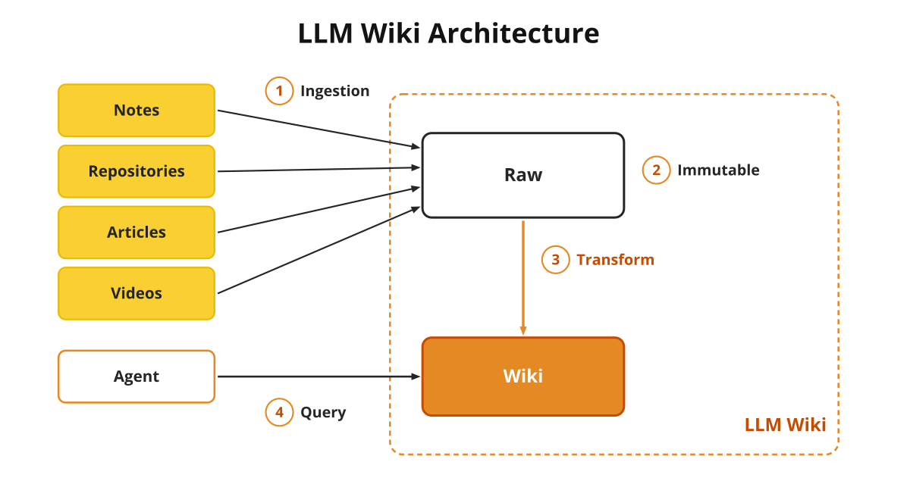

> **Try it first — 5 minutes:**
>
> ```bash
> git clone https://github.com/decodingai-magazine/llm-wiki-workshop.git
> cd llm-wiki-workshop/01-llm-wiki-vanilla
> claude          # or your harness
> ```
>
> Then type one prompt and watch a wiki appear:
>
> ```
> /01-llm-wiki-vanilla ingest ../data_input_examples/notes/01-easy/
> ```
>
> [Prerequisites](#prerequisites) · [full walkthrough](01-llm-wiki-vanilla/demo.md)

## Slides & video

📑 The presentation is available [here](https://canva.link/1k5z1bkoxq1pkhd) ↓

<a href="https://canva.link/1k5z1bkoxq1pkhd" target="_blank">
  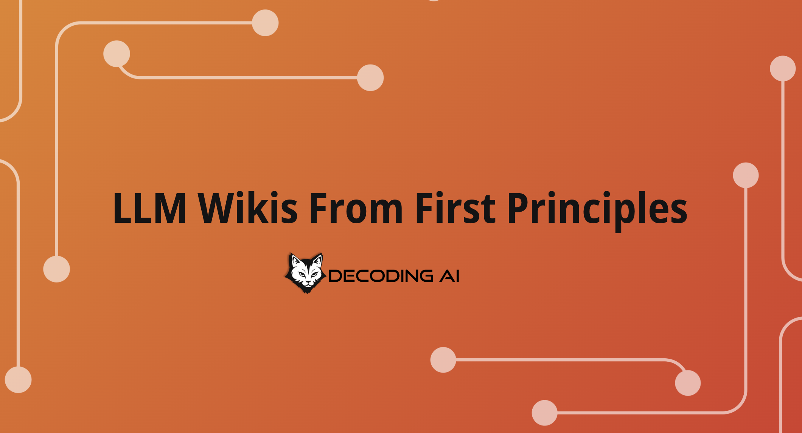
</a>

🎬 Video — *coming soon*.

<!-- When the recording is live, replace the line above with the clickable thumbnail:

🎬 Full workshop available on [YouTube](https://www.youtube.com/watch?v=VIDEO_ID) ↓

<a href="https://www.youtube.com/watch?v=VIDEO_ID">
  
</a>
-->

## How to use this repo

Three ways in. Pick the one that fits the time you have — or do all three in
order, since each builds on the last:

1. **Read a finished wiki. ~15 min, nothing to install.** Open a committed
   reference run —
   [`01-llm-wiki-vanilla/examples/wiki-01-ai-engineering/`](01-llm-wiki-vanilla/examples/wiki-01-ai-engineering/)
   is the smallest — ideally as an Obsidian vault. You'll see the two halves
   (`raw/` vs `wiki/`), every claim carrying its citation, and what the ≥2
   threshold chose to write, before running anything yourself.
2. **Run one layer's demo. ~30 min.** Install the
   [prerequisites](#prerequisites), `cd 01-llm-wiki-vanilla`, open your harness,
   and type the prompts in [`demo.md`](01-llm-wiki-vanilla/demo.md). Every
   prompt comes with one thing to verify.
3. **Work through all three layers. ~2–3 h.** Layers 01 and 02 start from
   nothing; layer 03 starts from a committed copy of layer 02's end state. Read
   each layer's `CHANGES-FROM-PREVIOUS.md` first to see exactly which files the
   new idea touched — that diff is the lesson.

## What an "LLM wiki" is

A directory of markdown files with two halves that never mix:

- **`raw/`** — immutable copies of what you ingested. What was said.
- **`wiki/`** — pages an LLM wrote from those copies. What you know.

Every page carries YAML frontmatter, every claim carries a `[[wikilink]]` to what
backs it, and one rule governs what exists at all:

> **A concept gets a page when ≥2 distinct sources engage with it.**

One note mentioning something is a fact about the note. Two notes mentioning it is
a fact about your knowledge. That single threshold is what stops the wiki filling
with stubs — and watching it fire is the most useful five minutes of the workshop.

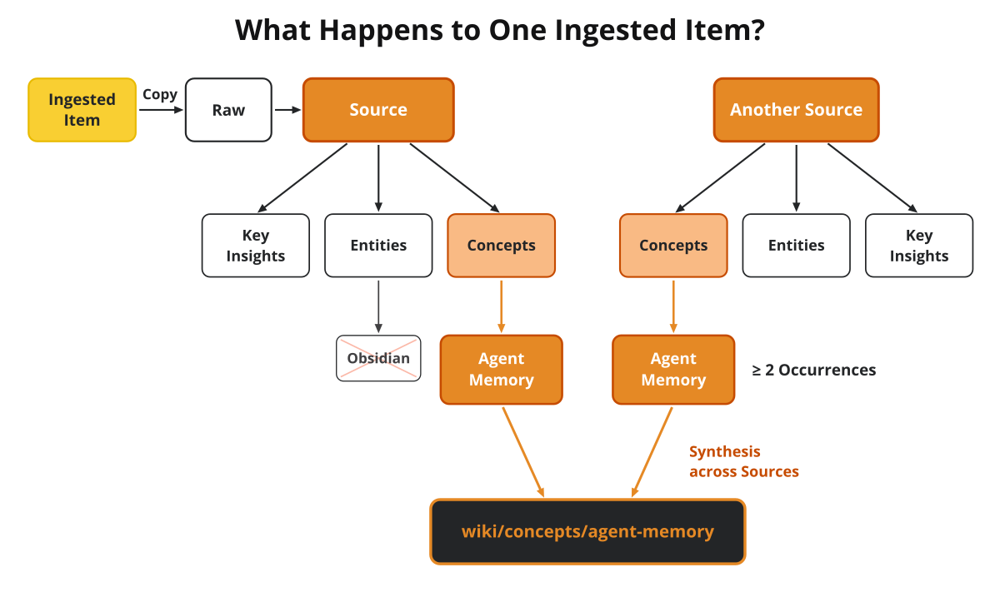

The navigation (`index.md` files) is a **derived cache**: delete it, re-run one
script, get identical bytes back. Nothing has to be kept in sync by hand.

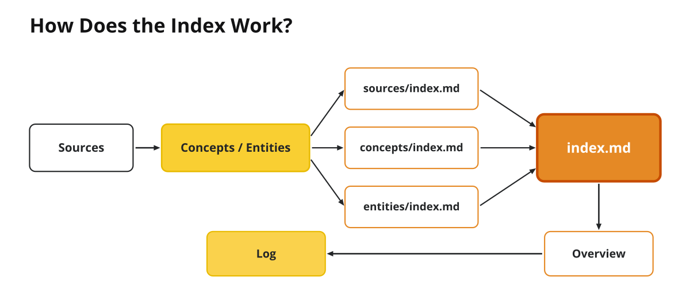

<table>
<tr>
<td align="center">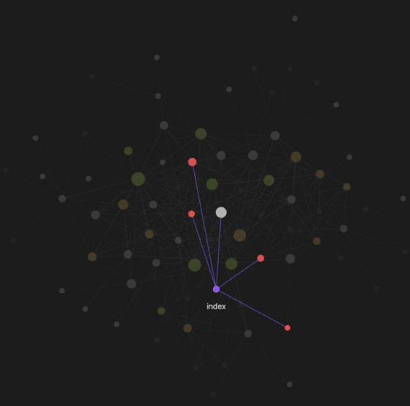</td>
<td align="center">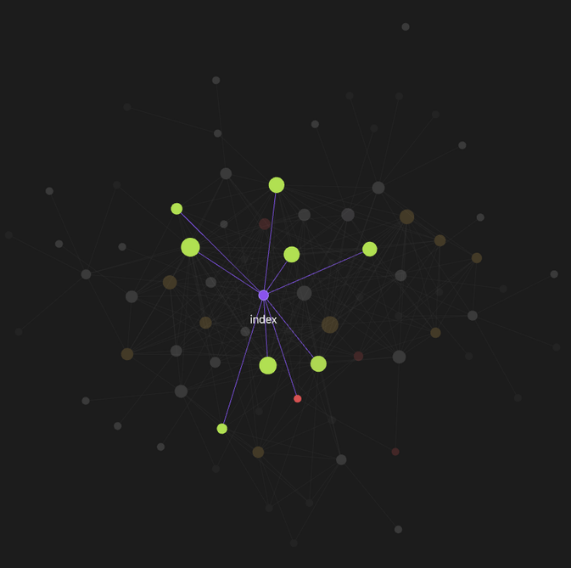</td>
</tr>
<tr>
<td align="center"><em>The master <code>index.md</code> — one hop to every section</em></td>
<td align="center"><em><code>concepts/index.md</code> — one hop to every concept page</em></td>
</tr>
</table>

This is what one looks like as an Obsidian graph — and what it grows into:

<table>
<tr>
<td align="center">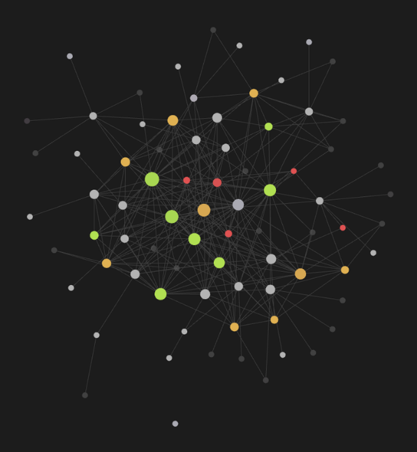</td>
<td align="center">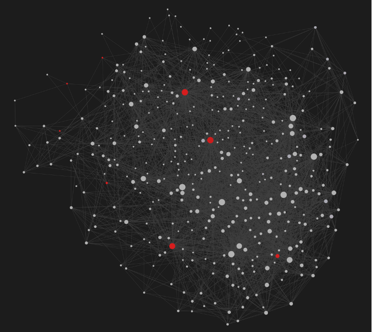</td>
</tr>
<tr>
<td align="center"><em>Layer 02's reference run — 14 sources, 17 nodes</em></td>
<td align="center"><em>The same system after months on a real corpus — 135 sources, 120 nodes</em></td>
</tr>
</table>

<details>
<summary><strong>What a page actually looks like</strong> — a real concept page from the layer 02 reference run (click to expand)</summary>

<br/>

Seven source-like pages — notes, articles **and a codebase** — engage with agent
memory, so [`wiki/concepts/agent-memory.md`](02-llm-wiki-ingest/examples/wiki-02-ai-engineering/wiki/concepts/agent-memory.md)
exists. Frontmatter is the contract; every claim in the body cites the source
page that backs it; disagreements between sources get their own `Tensions`
section; and the LLM's own judgment is fenced off as `> Synthesis:` — here,
noticing that six of the seven sources are one practitioner's voice, not
independent confirmation. Excerpt (full page at the link):

```markdown
---
type: concept
title: Agent Memory
description: The persistent layer that lets an agent reuse context across a
  session or across interactions — framed across sources either as a queryable
  knowledge graph reached through MCP tools, or as flat markdown files loaded
  wholesale into the system prompt at session start.
sources:
  - "[[wiki/sources/agentic-graphrag-via-mcp-servers]]"
  - "[[wiki/sources/article-building-a-coding-agent-from-scratch-system-design]]"
  - "[[wiki/sources/article-context-engineering-for-coding-agents]]"
  - "[[wiki/sources/article-the-coding-agent-loop]]"
  - "[[wiki/sources/mongodb-for-an-ai-agent-unified-memory]]"
  - "[[wiki/sources/the-right-way-of-building-agents-with-mcp-servers]]"
  - "[[wiki/repos/github-decodingai-magazine-building-a-coding-agent-from-scratch-course/ARCHITECTURE]]"
related:
  - "[[wiki/concepts/graphrag]]"
  - "[[wiki/concepts/mcp]]"
  - "[[wiki/concepts/agent-harness]]"
created: 2026-08-31T17:23:45Z
timestamp: 2026-08-31T20:15:00Z
source_count: 7
---

# Agent Memory

> Multiple framings — see Definition

## Key claims

- A knowledge graph — typed nodes and edges extracted from ingested documents
  — is the recurring representation across the three MCP-based sources […]
  [[wiki/sources/agentic-graphrag-via-mcp-servers]], [[wiki/sources/the-right-way-of-building-agents-with-mcp-servers]]
- Decode's memory is prompt-embedded, not tool-mediated: assembled once at
  session start, with `.decode/MEMORY.md` periodically rewritten in place […]
  [[wiki/sources/article-context-engineering-for-coding-agents]]

## Tensions

Two incompatible architectures share the name "agent memory" here. […] Neither
cluster reconciles the two — likely a scale question (personal knowledge base
vs. single coding session) that no source states directly.
[[wiki/repos/github-decodingai-magazine-building-a-coding-agent-from-scratch-course/ARCHITECTURE]]
lands squarely on the file-based side and hardens it […]

> Synthesis: Six of seven sources trace to one practitioner […] so their
> agreement still reads as one voice across time, not independent
> confirmation. [[wiki/sources/mongodb-for-an-ai-agent-unified-memory]]
> remains the sole architecturally independent, vendor-framed source […]
```

</details>

## The three layers

| Layer | Adds | The idea it teaches | Read the diff |
|---|---|---|---|
| **[01 · vanilla](#layer-01--vanilla)** | the whole mechanic, inline | Identity is the raw path, the ≥2 threshold, the index is a cache. Hard cap: 10 notes per run. | — |
| **[02 · ingest](#layer-02--ingest-at-scale)** | subagents + adapters | Fan-out is context engineering: each raw file is read **once**, by one agent, and the orchestrator only ever sees receipts. Anything with a URI becomes a source. | [CHANGES](02-llm-wiki-ingest/CHANGES-FROM-PREVIOUS.md) |
| **[03 · interactive](#layer-03--interactive)** | questions, notes, repo answers | The wiki learns from being used — and the interesting design work is deciding what **not** to count as evidence. | [CHANGES](03-llm-wiki-interactive/CHANGES-FROM-PREVIOUS.md) |

Each layer is a **superset** of the previous one: unchanged files are byte-identical,
and every changed file is listed section-by-section in its `CHANGES-FROM-PREVIOUS.md`.
A wiki built in one layer is a valid wiki in the next. The demos still stand alone:
layers 01 and 02 start from nothing, and layer 03 starts from a committed copy of
layer 02's end state.

Layer 01's cap is not a safety rail — it is the honest ceiling of doing everything in
one context; feed it the 50-note batch and it refuses. Removing the cause rather than
raising the number is how layer 02 earns its complexity.

## 📬 Learn more on LLM Wikis and agent memory

> Join 40k+ engineers reading [the Decoding AI Magazine](https://www.decodingai.com/) and watching [the Decoding AI YouTube channel](https://www.youtube.com/@itsdecodingai) to learn to design LLM wikis and advanced agent-memory techniques.

<a href="https://www.decodingai.com/" target="_blank">
  
</a>

## Prerequisites

This is the only place they are listed. Install these once and every skill in every
layer works out of the box — the skills run the scripts, clone the repos and fetch
the articles themselves. You only ever type prompts.

| | |
|---|---|
| **Skills** | Comfortable in a terminal. No coding required — you only type prompts. |
| **Level** | Anyone who has used an AI coding assistant; the layers teach the rest. |
| **Time** | ~30 min per layer, ~2–3 h for all three. |
| **Cost** | $0 beyond your harness's LLM usage — no API keys, no accounts. The optional 50-note ingest closing layer 02 is the only token-heavy step. |

| Requirement | Check | Install |
|---|---|---|
| An agent harness (Claude Code is the reference) | `claude --version` | [claude.com/claude-code](https://claude.com/claude-code) |
| Python ≥3.12 | `python3 --version` | `uv python install 3.12` or [python.org](https://www.python.org/downloads/) |
| [`uv`](https://docs.astral.sh/uv/) | `uv --version` | `curl -LsSf https://astral.sh/uv/install.sh \| sh` ([docs](https://docs.astral.sh/uv/getting-started/installation/)) |
| `git` + `curl` | `git --version`, `curl --version` | pre-installed on macOS/Linux |
| Obsidian (optional, recommended) | — | [obsidian.md](https://obsidian.md) |

What each is for:

- **The harness** must load a skill, read and write files, and run shell commands.
  Run `claude` inside a layer directory and it finds the skill through
  `.claude/skills`; anything equivalent works — nothing here pins a model or a
  tool name. Layers 02–03 also want a way to spawn subagents; if yours cannot,
  run the `agents/*.md` files as sequential prompts.
- **`uv`** is why there is no install step: the scripts are PEP 723 single files,
  and `uv` installs their dependencies the first time a skill runs one — no
  virtualenv.
- **`git` and `curl`** feed the repo and article adapters in layers 02–03. No
  GitHub token: the demo repo is public and cloned shallow.
- **Obsidian** is how you check your work. Open a layer's `wiki-ai-engineering/`
  as a vault and the graph view shows the wiki's shape, including the hollow
  nodes that mark ideas waiting for a second source.

**Verify the setup** — from the repo root, run one of the workshop's scripts
against a committed reference run:

```bash
uv run --script 01-llm-wiki-vanilla/.agents/skills/01-llm-wiki-vanilla/scripts/count_mentions.py \
  --wiki-dir 01-llm-wiki-vanilla/examples/wiki-01-ai-engineering
```

If it prints a mention table (12 slugs, 9 qualifying), `uv` and Python are wired
and every layer's scripts will run.

## How to run it

Each layer is a self-contained project with its own skill. Start in one, open your
harness there, and work through its `demo.md`:

```bash
cd 01-llm-wiki-vanilla
claude                     # or your harness

/01-llm-wiki-vanilla ingest ../data_input_examples/notes/01-easy/
```

Every layer ships the same three things:

- **`.agents/skills/<layer>/`** — the skill: `SKILL.md` is the orchestrator, the
  contract files beside it (`CONVENTIONS.md`, `PAGES.md`, and from 02 `SOURCES.md`
  and `agents/`, from 03 `QUERY.md`) are what it follows, and `scripts/` is what it
  runs. A committed `.claude/skills` symlink points Claude Code at it.
- **`demo.md`** — the exact prompts to type, each with one thing to check.
- **`examples/wiki-ai-engineering/`** — a **committed reference run**, so you can
  read the output before producing your own. In layer 03 it is the demo's start
  point.

The wiki you build lands in `<layer>/wiki-ai-engineering/` and is gitignored. To
verify anything, open that directory as an Obsidian vault. To start over, delete it.

## The inputs

[`data_input_examples/`](data_input_examples/) holds everything the workshop
ingests. Pass paths and URLs to the skills relative to the layer directory
(`../data_input_examples/...`).

| Input | What | Used by |
|---|---|---|
| `notes/01-easy/` | 5 notes — one tight cluster (MCP vs. skills vs. CLIs) | layer 01 |
| `notes/02-medium/` | 10 notes — easy + 5 bridging notes (context layer, memory, GraphRAG, harness) | layer 02, from scratch |
| `notes/03-hard/` | all 50 notes, including tiny and noisy personal ones | layer 02's optional last step; layer 03 starts from its result |
| `github_repositories.md` | one repo URL | layer 02 |
| `substack_articles.md` | four article URLs; the demo ingests two | layer 02 |

The tiers are nested (5 ⊂ 10 ⊂ 50) and a note's identity is its filename, so
ingesting a larger tier over a smaller one skips what is already there — that is
the dedup demo. Each tier carries **its own `assets/`** with exactly the files its
notes embed, as a sibling folder, so `![[assets/….png]]` resolves in any vault.
Ingest copies a note *and its attachments* into `raw/`, so the embeds keep working
there. Attachments are not sources: no page, no threshold vote. Only `*.md` is
ingested, which is why the three `.srt` transcripts in `03-hard/assets/` land in
`raw/` and stay unread — the standing exercise is the adapter that reads them.

---

## Layer 01 — vanilla

**Goal: see the whole mechanic with zero moving parts.** One skill, two scripts, no
subagents, no web.

**Ingest.** The orchestrator does everything itself: copies each note (and its
attachments) into `raw/`, reads it, writes one source page whose every claim cites
`[[raw/...]]`, then runs the *ingest tail* — `count_mentions.py` names every slug
at ≥2 source pages, a page is written or updated for each, `overview.md` is
rewritten, `build_index_md.py` regenerates the indexes, `log.md` gets one entry.
Concept pages cite **source pages**, never raw, so they compound as sources
accumulate without anyone re-reading the notes. Hard cap of 10 notes per run,
because one context has to hold all of them.

**Query** is read-only: `index.md` → a concept page → maybe a source page, and
`raw/` only if a page genuinely fails. Every claim carries a wikilink; the only
file that changes is `log.md`. If the wiki does not know, it says so.

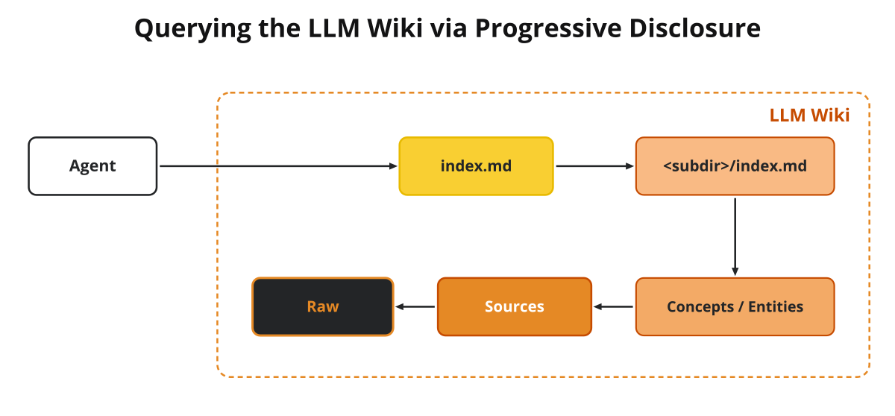

**Run it** — [`01-llm-wiki-vanilla/demo.md`](01-llm-wiki-vanilla/demo.md): ingest
the 5 easy notes, ask one question, look at the graph.

```
/01-llm-wiki-vanilla ingest ../data_input_examples/notes/01-easy/
/01-llm-wiki-vanilla what do my notes say about when to use an MCP server vs. a CLI?
```

**Look at:** the ingest report's "waiting at 1 mention" list — the wiki telling
you what it is about to learn; `raw/assets/`, the images copied in beside the
notes so the embeds still render; and in Obsidian the hollow nodes, which are the
same list drawn as a graph.

## Layer 02 — ingest at scale

**Goal: remove the ceiling, and let anything with a URI become a source.**

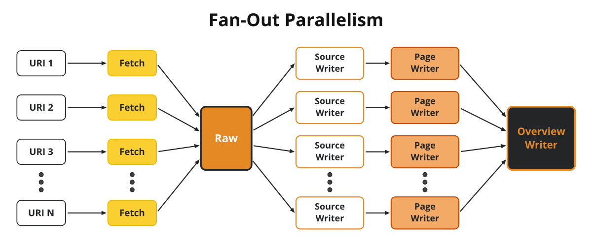

**Ingest changes who reads.** Every page is written by a subagent defined as plain
markdown in `agents/`: `source_writer` reads one raw file — the only agent allowed
to — `repo_writer` reads one clone, `page_writer` reads only the source pages for
its slug, `overview_writer` reads frontmatter. The orchestrator routes, spawns and
collects JSON receipts; it never sees a note. Fifty notes cost about the same
orchestrator context as five, which is why the cap is deleted rather than raised.

The other half is the **adapter contract** (`SOURCES.md`): one URI in, one raw
artifact plus one receipt out, and nothing downstream learns where anything came
from. Local notes, web articles (`curl` + body isolation) and GitHub repos (shallow
clone into a hidden dot-folder, then an `ARCHITECTURE.md` of ≤300 lines with
SHA-pinned permalinks) ship; YouTube is a skeleton that fails loudly, and wiring it
up is the exercise. Repos are the one origin that **refreshes** instead of skipping,
because the code moves. A repo page is source-like: a codebase and a note are two
independent witnesses, so together they can materialize a concept.

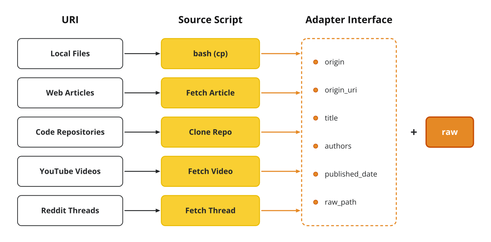

**Query** is unchanged, except that code questions start at `ARCHITECTURE.md` — it
exists so nobody has to read the clone.

**Run it** — [`02-llm-wiki-ingest/demo.md`](02-llm-wiki-ingest/demo.md), from
scratch: 10 notes → the repo → two articles → refresh the repo → YouTube fails →
a query across origins → optionally all 50 notes. What changed from 01:
[`CHANGES-FROM-PREVIOUS.md`](02-llm-wiki-ingest/CHANGES-FROM-PREVIOUS.md).

```
/02-llm-wiki-ingest ingest ../data_input_examples/notes/02-medium/
/02-llm-wiki-ingest ingest https://github.com/decodingai-magazine/building-a-coding-agent-from-scratch-course
/02-llm-wiki-ingest ingest https://www.decodingai.com/p/building-a-coding-agent-from-scratch-system-design https://www.decodingai.com/p/the-coding-agent-loop
```

**Look at:** the concept page whose `sources:` lists a note *and* the repo;
`raw/article-*.md` next to the live page — body isolation is the difference between
a source and a cookie banner; and after the optional last step, the three-line
pages the noisy notes produce. Noise is cheap; the threshold made it so.

## Layer 03 — interactive

**Goal: make interaction a second way for the graph to grow.**

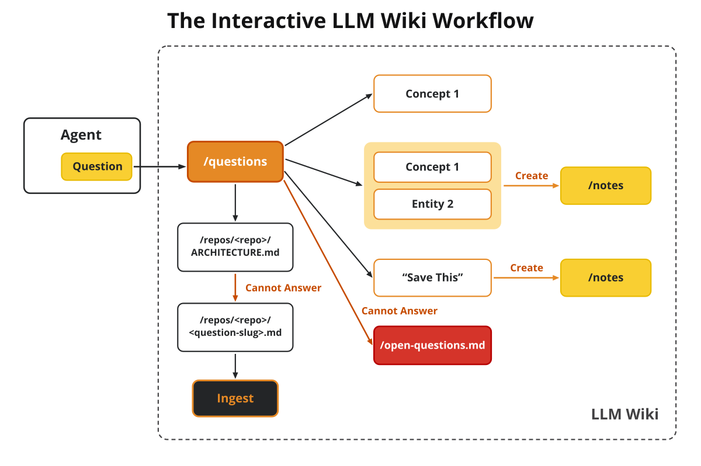

**Ingest is unchanged.** **Query now writes back**, under three write regimes:
ingest-owned pages (`raw/`, `sources/`, `entities/`, `concepts/`, `overview.md`,
`ARCHITECTURE.md`) are read-only; interaction-owned pages (`questions/`, `notes/`,
`open-questions.md`) are written freely; a **repo note** is written by
`repo_writer` in question mode and then run through the same ingest tail as any
source. So: every question leaves a slim pointer page; an answer that cited ≥2
pages becomes a note, and asking again *enriches* that note instead of forking it;
a question the wiki cannot answer becomes an open question — said plainly, and
nothing resolves it automatically; a question that needs the code produces a repo
note that is source-like, so **an answer can push a concept over the threshold**.

`questions/` and `notes/` are deliberately *not* source-like. A wiki that counts its
own notes as evidence can cite itself into existence.

**Run it** — [`03-llm-wiki-interactive/demo.md`](03-llm-wiki-interactive/demo.md):
copy the layer's `examples/` (layer 02's end state, nothing asked of it yet) and
ask seven questions. The clone is not in the copy; the skill re-clones on its own
when a question needs the code. What changed from 02:
[`CHANGES-FROM-PREVIOUS.md`](03-llm-wiki-interactive/CHANGES-FROM-PREVIOUS.md).

```bash
cp -r examples/wiki-ai-engineering .
```

```
/03-llm-wiki-interactive when should I use an append-only log instead of updating rows in place?
/03-llm-wiki-interactive how do I decide that a fact in the memory has gone stale?
/03-llm-wiki-interactive in the coding agent repo, how does a tool call actually get routed to the permission gate, and what happens while it waits for the human?
```

**Look at:** a note with two entries in `spawned_by_question` and its first
`created`; the repo note and the concept page it pushed into `sources:` — trace it,
question → repo note → recount → updated page; and `git status` on the ingest-owned
pages: the only ones that changed are the ones the tail touched.

---

## 📬 Learn more on LLM Wikis and agent memory

> Join 40k+ engineers reading [the Decoding AI Magazine](https://www.decodingai.com/) and watching [the Decoding AI YouTube channel](https://www.youtube.com/@itsdecodingai) to learn to design LLM wikis and advanced agent-memory techniques.

<a href="https://www.decodingai.com/" target="_blank">
  
</a>

## What the reference runs actually contain

Not a toy. Layer 02's committed run — the one layer 03 starts from — is 53
source-like pages: 50 notes, 2 articles and a codebase, supporting 10 entity pages
and 38 concept pages, with every claim cited and every link resolving.
It is worth opening before you run anything, because it shows what the threshold
produces on real, messy input: a marketing draft and a three-line meeting note get
pages too, and they correctly connect to almost nothing.

## The five ideas, in order of how much they'll change your systems

1. **Identity is the raw path.** Dedup is an `ls`, not a database. Ingest the same
   note through two directories and nothing happens.
2. **The ≥2 threshold.** What you refuse to write down matters more than what you do.
3. **Read raw once, ever.** After ingestion, the wiki *is* the interface — which is
   what makes the cost of ingesting compound instead of repeat.
4. **Receipts are the interface.** The orchestrator coordinates writers it cannot
   see, using a JSON shape specified as tightly as the pages themselves.
5. **Regimes, not permissions.** Reading a source can never change what the wiki
   says that source means — otherwise the same question asked twice leaves two
   different wikis behind.

## Resources

| Resource | What it is |
|---|---|
| [Introducing the Open Knowledge Format](https://cloud.google.com/blog/products/data-analytics/how-the-open-knowledge-format-can-improve-data-sharing) | Google Cloud's introduction to OKF and why a shared shape for knowledge bundles matters. |
| [Open Knowledge Format (OKF) spec](https://github.com/GoogleCloudPlatform/open-knowledge-format/blob/main/SPEC.md) | The spec the `wiki/` bundle aligns with: markdown + frontmatter, path is identity, the index is a rebuildable cache. `CONVENTIONS.md` §10 lists what we honour and where we diverge. |
| [Andrej Karpathy's `llm-wiki` gist](https://gist.github.com/karpathy/442a6bf555914893e9891c11519de94f) | The idea file this pattern traces back to: an LLM that incrementally builds and maintains a persistent wiki, instead of re-deriving answers from raw documents on every query. |
| [Turn 10,994 Notes Into Memory](https://www.decodingai.com/p/llm-wiki-agent-memory) · [video](https://www.youtube.com/watch?v=ZRM_TfEZcIo) | The Decoding AI lesson behind this workshop — an LLM wiki as agent memory, run against a real 10,994-note corpus. |
| [LangChain's OpenWiki](https://github.com/langchain-ai/openwiki) | A CLI that writes and maintains agent documentation for your codebase — the same pattern, pointed at code. |

## Layout

```
llm-wiki-workshop/
├── data_input_examples/       # the fixture: 50 notes in 3 nested scenarios + link files
├── 01-llm-wiki-vanilla/       # layer 01: skill, scripts, demo, committed example run
├── 02-llm-wiki-ingest/        # layer 02: + agents, adapters, SOURCES.md, CHANGES
├── 03-llm-wiki-interactive/   # layer 03: + QUERY.md, questions, notes, open questions
└── implementation_plan.md     # how this repo was specified before it was built
```

This is the only README. Each layer's `demo.md` is its walkthrough. Live runs
(`<layer>/wiki-*/`) and repo clones are gitignored; the committed runs under
`examples/` are the ones to read.

## Questions and troubleshooting

Open a [GitHub issue](https://github.com/decodingai-magazine/llm-wiki-workshop/issues)
for setup trouble, questions about the contracts, or anything a demo step doesn't
explain.

## FAQ

**Do I need Claude Code?**
No. Any harness that can load a skill, read and write files, and run shell
commands works — nothing pins a model or a tool name. Layers 02–03 also want
subagents; without them, run the `agents/*.md` files as sequential prompts.

**Can I point it at my own notes?**
Yes — that is the point. Pass any directory of markdown to an ingest prompt, and
swap the URLs in `data_input_examples/*.md` for your own articles and repos. The
fixture exists only so every reader can reproduce the same wiki.

**Is Obsidian required?**
No — it is the inspection tool, not a dependency. Everything is plain markdown;
Obsidian's graph view just makes the threshold visible (hollow nodes are ideas
waiting for a second source).

**Why markdown files instead of a database?**
Because the wiki's reader is an LLM: markdown with frontmatter is what a model
navigates natively, `git` is the audit log, and dedup is an `ls`. See
[the five ideas](#the-five-ideas-in-order-of-how-much-theyll-change-your-systems).

## 👨‍🏫 Author

<table style="border-collapse: collapse; border: none;">
  <tr style="border: none;">
    <td width="15%" align="center" style="border: none;">
      <a href="https://www.pauliusztin.ai/" target="_blank">
        
      </a>
      <br/>
      <b>Paul Iusztin</b>
    </td>
    <td width="85%" style="border: none;">
      Senior AI Engineer, Educator & Founder of Decoding AI. Author of the best-selling <a href="https://www.amazon.com/LLM-Engineers-Handbook-engineering-production/dp/1836200072">LLM Engineer's Handbook</a>.
    </td>
  </tr>
</table>

## ⭐ One more thing

If this workshop was useful, consider starring the repository so others can find
it too.

## License

MIT — see [LICENSE](LICENSE). Take the contracts, the scripts and the page
templates and point them at your own notes.

---

Built by [Decoding AI](https://www.decodingai.com).
